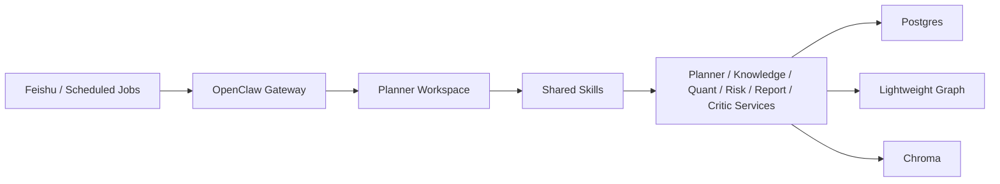

# OpenClaw Quant Research

## Project Overview

OpenClaw Quant Research is a multi-agent equity research system built on top of OpenClaw.
It is designed for public-market research workflows rather than live trading.

The project combines:

- public news and announcement ingestion
- retrieval-augmented document search
- technical, valuation, and fundamental analysis
- risk analysis
- daily and weekly report generation
- Feishu-based interactive research queries

The current repository is no longer a proposal-only codebase. It is a working MVP with:

- `ingestion` for public information collection
- `rag` for indexing and retrieval
- `planner` as the unified entry point
- `quant` for technical + fundamental analysis
- `risk` for portfolio and drawdown analysis
- `report` for daily and weekly report generation
- `critic` for report validation

The repository is organized as:

- shared deterministic services under `services/`
- OpenClaw-native orchestration assets under `openclaw/workspaces/`, `openclaw/skills/`, and `openclaw/runtime/`

## Current Architecture

### High-Level Flow



### Runtime Collaboration Model

The current runtime is no longer planner-only orchestration.

Implemented collaboration paths:

- `DOC_QA`: `Planner -> Knowledge`
- `QUANT_QUERY`: `Planner -> Quant`
- `RISK_QUERY`: `Planner -> Risk`
- `MIXED_QUERY`: `Planner -> parallel(Knowledge, Quant, Risk)`
- `DAILY_REPORT`: `Planner -> parallel(Knowledge, Quant, Risk) -> Report -> Critic`
- `WEEKLY_REPORT`: `Planner -> Knowledge + Quant + Risk -> Report -> Critic`

The most important collaborative paths already use parallel sub-agent style orchestration:

- mixed research questions run `Knowledge + Quant + Risk` in parallel
- daily report generation runs `Knowledge + Quant + Risk` in parallel before `Report + Critic`

### Data Architecture

The system uses a three-layer storage and retrieval model:

- `Postgres`
  - primary structured storage
  - document metadata
  - graph entities and relations
  - report index
  - run logs
  - metric and risk snapshots
- `Lightweight Knowledge Graph`
  - entity and relation layer stored on top of Postgres tables
  - companies, themes, industries, announcements, and document links
- `Chroma`
  - vector index for document chunks
  - hybrid retrieval with keyword and semantic search

Additional local data directories:

- `data/raw` for raw news and announcement documents
- `data/market` for local market parquet files
- `data/financials` for cached fundamental data
- `data/reports` for archived reports

## Quant Capabilities

The `quant` module has been upgraded from a price-only MVP to a combined technical and fundamental analysis module.

Supported capabilities include:

- Technical indicators
  - close price
  - percentage change
  - moving averages
  - MA signal
  - `momentum_1m`
  - `momentum_3m`
  - `volatility_1m`
  - `price_rank_1y`
- Valuation factors
  - `pe_ttm`
  - `pb`
  - `market_cap`
- Financial factors
  - `roe`
  - `gross_margin`
  - `net_margin`
  - `revenue_growth`
  - `net_profit_growth`
  - `debt_to_asset`
  - `current_ratio`
  - `quick_ratio`
- Industry-relative comparison
  - `industry_pe_percentile`
  - `industry_pb_percentile`
  - `industry_roe_percentile`
  - `industry_revenue_growth_percentile`
- Composite analysis
  - `technical_score`
  - `fundamental_score`
  - `valuation_score`
  - `composite_score`
  - `composite_signal`

## Repository Structure

```text
services/     FastAPI services and business logic
scripts/      setup, sync, validation, and demo scripts
docs/         plans, architecture, and project documentation
templates/    daily and weekly report templates
tests/        regression and smoke tests
data/         local runtime data and generated artifacts
openclaw/     OpenClaw-native workspaces, skills, and runtime helpers
```

## Usage

### Prerequisites

- Python 3.11+
- Docker Desktop
- PowerShell on Windows
- Optional: OpenClaw CLI and Feishu credentials for channel testing

### 1. Clone and Configure

Copy the environment template:

```powershell
Copy-Item .env.example .env
```

Then edit `.env` and confirm at least:

- `POSTGRES_PASSWORD`
- `DATABASE_URL`
- optional model keys if you want live provider integration
- optional Feishu/OpenClaw values if you want channel testing

### 2. Bootstrap the Project

For a new machine, the fastest path is:

```powershell
powershell -ExecutionPolicy Bypass -File .\scripts\dev_bootstrap.ps1
```

This command will:

- start `postgres`, `chroma`, and `adminer`
- initialize the database schema
- fetch sample market data
- verify the storage stack
- run the smoke test suite

Optional bootstrap flags:

```powershell
powershell -ExecutionPolicy Bypass -File .\scripts\dev_bootstrap.ps1 -SyncOpenClaw -StartServices
```

### 3. Start the Full Docker Stack

To run infrastructure and all API services in containers:

```powershell
docker compose up -d
```

This will start:

- `postgres`
- `chroma`
- `adminer`
- `ingestion`
- `rag`
- `quant`
- `risk`
- `planner`
- `report`
- `critic`

To stop the full stack:

```powershell
docker compose down
```

### 4. Start Local API Services Without Containers

If you want Docker only for infrastructure and Python processes for the API layer:

```powershell
powershell -ExecutionPolicy Bypass -File .\scripts\dev_up.ps1
```

Stop them with:

```powershell
powershell -ExecutionPolicy Bypass -File .\scripts\dev_down.ps1
```

### 5. Manual Infrastructure Commands

If you want to run the setup steps separately:

```powershell
docker compose up -d postgres chroma adminer
python scripts/init_db.py
python scripts/fetch_sample_data.py
python scripts/verify_stack.py
python scripts/run_phase0_smoke.py
```

### 6. Run the Planner Service Manually

If you only want the planner service without the one-click launcher:

```powershell
uvicorn services.planner.main:app --host 0.0.0.0 --port 8005
```

### 7. Run Local Demos

```powershell
python .\scripts\call_planner_service.py "Recent announcements of Kweichow Moutai"
python .\scripts\run_planner_demo.py "Recent announcements of Kweichow Moutai"
python .\scripts\run_knowledge_demo.py "Recent announcements of Kweichow Moutai" --stock-code 600519 --top-k 5
python .\scripts\run_quant_demo.py --stock-code 600519 --stock-code 300750 --mode daily
python .\scripts\run_quant_demo.py --stock-code 600519 --factor pe_ttm --factor roe --factor revenue_growth --factor composite_score --mode factor
python .\scripts\run_risk_demo.py --holding 600519:0.4 --holding 300750:0.35 --holding 000001:0.25 --mode check
python .\scripts\run_risk_demo.py --stock-code 600519 --stock-code 300750 --mode drawdown
python .\scripts\run_daily_report_demo.py --date 2026-04-05 --stock-code 600519 --stock-code 300750
python .\scripts\run_weekly_report_demo.py --date 2026-04-05 --stock-code 600519 --stock-code 300750
```

### 8. Run Tests

Fast local validation:

```powershell
python .\scripts\verify_stack.py
python .\scripts\run_phase0_smoke.py
```

Full regression suite:

```powershell
pytest -q -p no:cacheprovider .\tests
```

### 9. Sync OpenClaw Runtime

Sync the local OpenClaw runtime with this project:

```powershell
powershell -ExecutionPolicy Bypass -File .\openclaw\runtime\bootstrap.ps1 -SkipCron -SkipGatewayRestart
```

To sync cron jobs as well:

```powershell
powershell -ExecutionPolicy Bypass -File .\openclaw\runtime\bootstrap.ps1 -SkipGatewayRestart
```

To restart the OpenClaw gateway:

```powershell
openclaw gateway restart
```

## Notes

- The repository is structured so another user can `git clone`, copy `.env.example` to `.env`, run `dev_bootstrap.ps1`, and use the project locally.
- The repository also supports a full Docker-based API stack through `docker compose up -d`.
- The one-click scripts manage local development workflows; they do not package Feishu credentials or your personal OpenClaw auth state.
- Feishu is connected through the existing OpenClaw runtime.
- The preferred online path is:
  - `Feishu -> OpenClaw Gateway -> Planner Agent -> call_planner_service.py -> planner HTTP service`
- For stable Feishu behavior, the local planner service on `localhost:8005` must be running.
- Chroma is used through HTTP first and falls back to local persistent storage if needed.
- OpenClaw role definitions live under `openclaw/workspaces/`.
- Shared service invocation contracts live under `openclaw/skills/`.
- The current MVP already has enough architecture and test coverage for assignment submission and GitHub presentation without further major refactoring.
