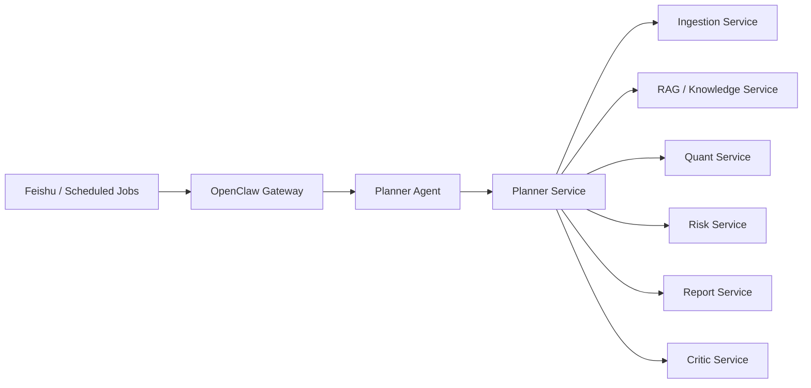

# OpenClaw Quant Research

## Project Overview

OpenClaw Quant Research is a multi-agent equity research system built on top of OpenClaw.  
It is designed for public-market research workflows rather than live trading.

The system combines:

- public news and announcement ingestion
- retrieval-augmented document search
- quantitative analysis
- risk analysis
- daily and weekly report generation
- Feishu-based interactive research queries

The current implementation is a working MVP with a complete local workflow:

- `ingestion` for public information collection
- `rag` for indexing and retrieval
- `planner` as the unified entry point
- `quant` for technical and fundamental analysis
- `risk` for portfolio and drawdown analysis
- `report` for daily and weekly report generation
- `critic` for report validation

## Project Architecture

### High-Level Flow



### Data Architecture

The system uses a three-layer storage and retrieval model:

- `Postgres`
  - primary structured storage
  - document metadata
  - graph entities and relations
  - report index
  - run logs
  - metric and risk snapshots
- `Lightweight Knowledge Graph`
  - entity and relation layer stored on top of Postgres tables
  - companies, themes, industries, announcements, document links
- `Chroma`
  - vector index for document chunks
  - hybrid retrieval with keyword and semantic search

Additional local data directories:

- `data/raw` for raw news and announcement documents
- `data/market` for local market parquet files
- `data/financials` for cached fundamental data
- `data/reports` for archived reports

### Main Services

- `services/ingestion`
  - fetches news and announcements
  - deduplicates documents
  - writes raw files and metadata
- `services/rag`
  - chunks documents
  - writes embeddings to Chroma
  - performs hybrid retrieval
  - builds evidence packs
- `services/planner`
  - classifies user intent
  - routes `DOC_QA`, `DAILY_REPORT`, and `WEEKLY_REPORT`
  - orchestrates downstream services
- `services/quant`
  - computes technical indicators
  - loads and caches fundamentals
  - computes valuation factors
  - supports industry-relative comparison
  - produces combined technical + fundamental analysis
- `services/risk`
  - portfolio volatility
  - max drawdown
  - beta
  - industry exposure
  - scenario loss estimation
- `services/report`
  - renders daily and weekly report templates
  - archives generated reports
- `services/critic`
  - validates report coverage, freshness, and consistency

## Quant Capabilities

The `quant` module has already been upgraded from a price-only MVP to a combined technical and fundamental analysis module.

Currently supported:

- Technical indicators
  - close price
  - percentage change
  - moving averages
  - MA signal
  - `momentum_1m`
  - `momentum_3m`
  - `volatility_1m`
  - `price_rank_1y`
- Valuation factors
  - `pe_ttm`
  - `pb`
  - `market_cap`
- Financial factors
  - `roe`
  - `gross_margin`
  - `net_margin`
  - `revenue_growth`
  - `net_profit_growth`
  - `debt_to_asset`
  - `current_ratio`
  - `quick_ratio`
- Industry-relative comparison
  - `industry_pe_percentile`
  - `industry_pb_percentile`
  - `industry_roe_percentile`
  - `industry_revenue_growth_percentile`
- Composite analysis
  - `technical_score`
  - `fundamental_score`
  - `valuation_score`
  - `composite_score`
  - `composite_signal`

## Repository Structure

```text
agents/       OpenClaw agent instructions
services/     FastAPI services and business logic
scripts/      setup, sync, validation, and demo scripts
docs/         plans, architecture, and project documentation
templates/    daily and weekly report templates
tests/        regression and smoke tests
data/         local runtime data and generated artifacts
```

## Usage

### 1. Environment Setup

Copy the environment template:

```powershell
Copy-Item .env.example .env
```

### 2. Start Infrastructure

Start Postgres and Chroma:

```powershell
docker compose up -d postgres chroma
```

### 3. Initialize the Database

```powershell
python scripts/init_db.py
```

### 4. Verify the Stack

```powershell
python scripts/verify_stack.py
python scripts/fetch_sample_data.py
python scripts/run_phase0_smoke.py
```

### 5. Run the Planner Service

```powershell
uvicorn services.planner.main:app --host 0.0.0.0 --port 8005
```

Available planner endpoints:

- `GET /health`
- `POST /api/v1/planner/classify`
- `POST /api/v1/planner/query`
- `POST /api/v1/planner/run-logs`
- `POST /api/v1/planner/run-logs/replay`
- `POST /api/v1/planner/alerts/summary`

### 6. Run Local Demos

Planner:

```powershell
python .\scripts\call_planner_service.py "Recent announcements of Kweichow Moutai"
python .\scripts\run_planner_demo.py "Recent announcements of Kweichow Moutai"
```

Knowledge:

```powershell
python .\scripts\run_knowledge_demo.py "Recent announcements of Kweichow Moutai" --stock-code 600519 --top-k 5
```

Quant:

```powershell
python .\scripts\run_quant_demo.py --stock-code 600519 --stock-code 300750 --mode daily
python .\scripts\run_quant_demo.py --stock-code 600519 --factor pe_ttm --factor roe --factor revenue_growth --factor composite_score --mode factor
```

Risk:

```powershell
python .\scripts\run_risk_demo.py --holding 600519:0.4 --holding 300750:0.35 --holding 000001:0.25 --mode check
python .\scripts\run_risk_demo.py --stock-code 600519 --stock-code 300750 --mode drawdown
```

Reports:

```powershell
python .\scripts\run_daily_report_demo.py --date 2026-04-05 --stock-code 600519 --stock-code 300750
python .\scripts\run_weekly_report_demo.py --date 2026-04-05 --stock-code 600519 --stock-code 300750
```

### 7. Sync OpenClaw Runtime

Sync the local OpenClaw runtime with this project:

```powershell
powershell -ExecutionPolicy Bypass -File .\scripts\setup_openclaw_runtime.ps1 -SkipCron -SkipGatewayRestart
```

To sync cron jobs as well:

```powershell
powershell -ExecutionPolicy Bypass -File .\scripts\setup_openclaw_runtime.ps1 -SkipGatewayRestart
```

To restart the OpenClaw gateway:

```powershell
openclaw gateway restart
```

## Notes

- Feishu is connected through the existing OpenClaw runtime.
- The preferred online path is:
  - `Feishu -> OpenClaw Gateway -> Planner Agent -> call_planner_service.py -> planner HTTP service`
- For stable Feishu behavior, the local planner service on `localhost:8005` must be running.
- Chroma is used through HTTP first and falls back to local persistent storage if needed.
