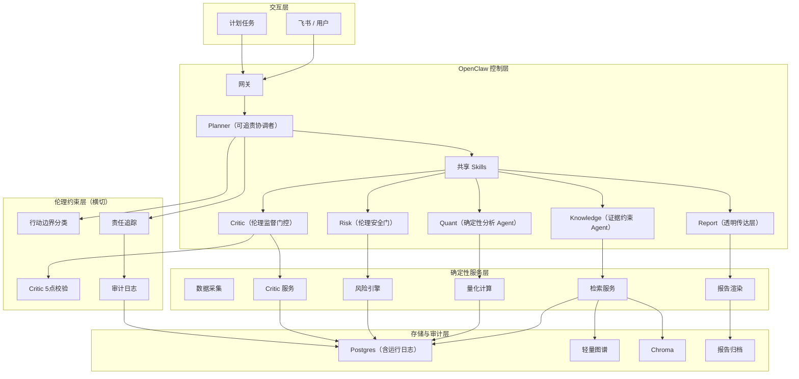

# Ethics-Oriented Project Transformation Plan（修订版）

> 本文档为第二版，基于已完成的代码实施进行更新。第一版为改造方向规划，本版在此基础上补充了已完成状态、剩余工作的具体执行规格，以及演示与评估指导。

---

## 1. 改造目标

将现有 OpenClaw 量化投研 MVP 重新定位为：

> **一个基于 OpenClaw 的、强调证据约束、风险审查、人工监督与可审计性的多 Agent 决策支持系统。**

英文定位：

> An evidence-grounded, risk-aware, human-supervised multi-agent decision support system built on OpenClaw.

核心问题陈述：

> 多个 AI Agent 在协作完成复杂分析任务时，如何确保不逾越证据边界、不绕过审查、不产生不可审计的结论？

---

## 2. 改造策略：保持架构、重塑语义

本项目已具备大多数伦理导向系统所需的基础机制：

| 已有机制 | 对应伦理价值 |
|---|---|
| 证据包检索（RAG） | 结论可溯源 |
| Critic 校验 | 独立审查 |
| 风险门控（Risk） | 安全约束 |
| 运行日志与审计追踪 | 可审计性 |
| 工作区角色隔离 | 职责边界 |
| 人工审批字段 | 人工监督 |

改造不需要重建架构，需要的是：

1. 输出契约扩展（ethics metadata）
2. Critic 变为强制伦理门控
3. 行动边界分层（三类输出）
4. 审计语义扩展
5. 叙事与文档重塑

---

## 3. 当前实施状态

### 3.1 已完成（代码已合并）

#### Phase 0 — Bug 修复

| 文件 | 修复 |
|---|---|
| `services/planner/models.py` | `ApiResponse.timestamp` 改为 `Field(default_factory=datetime.now)` |
| `services/critic/service.py` | `_timeliness_check` 补充 UTC 时区；`alerts[:2]` 改为检查全部告警 |
| `services/planner/pipeline.py` | 量化关键词增加 `"ROE"` / `"PE"` 大写形式 |

#### Phase 1 — 输出契约

新建 `services/common/ethics.py`，提供四个共享函数：

```python
compute_evidence_status(evidence_count, coverage_warning) -> str
# "SUFFICIENT" | "PARTIAL" | "INSUFFICIENT" | "NONE"

compute_data_freshness(latest_data_date) -> str
# "FRESH"(≤3天) | "ACCEPTABLE"(≤7天) | "STALE"(>7天) | "UNKNOWN"

classify_action_boundary(intent, critic_status, conflict_detected,
                         risk_status, evidence_count,
                         critic_recommended=None) -> str
# "informational_only" | "analysis_only" | "requires_human_approval"
# 优先级规则（从高到低）：
# 1. critic_status == "FAIL" → informational_only
# 2. conflict_detected → requires_human_approval
# 3. risk_status in {HIGH, CRITICAL} → requires_human_approval
# 4. intent in {DAILY_REPORT, WEEKLY_REPORT} → requires_human_approval
# 5. intent == MIXED_QUERY and evidence_count >= 3 → analysis_only
# 6. 其余 → informational_only

build_accountability_trail(...) -> dict
# 结构化责任追踪字段
```

`PlannerResponse` 新增 7 个伦理字段：

```python
evidence_status: str         # 证据充足性
data_freshness: str          # 数据时效
risk_status: str             # 风险等级
conflict_detected: bool      # 是否检测到冲突
human_approval_required: bool
action_boundary: str         # 行动边界分层
accountability_trail: dict   # 责任追踪
```

`services/planner/router.py` 的所有接口均已暴露上述字段。
当 `human_approval_required=True` 时，飞书摘要自动添加：
`【⚠ 需要人工审批后方可执行任何操作】`

#### Phase 2 — Critic 伦理门控

`services/critic/service.py` 新增 5 点伦理校验清单：

| 清单项 | 字段 | 判断逻辑 |
|---|---|---|
| 关键结论有据可查 | `claims_supported_by_evidence` | 证据覆盖率 ≥ 0.5 |
| 数据时效已标注 | `data_freshness_explicit` | 内容含"数据日期"或"数据区间" |
| 分析与风险无冲突 | `no_analysis_risk_conflict` | `_consistency_check == PASS` |
| 无过度确定性表述 | `no_overstatement` | 不含推荐买入等词汇 |
| 行动边界已标注 | `action_boundary_appropriate` | 内容含"行动边界"或"人工审批" |

过度表述检测词：`["推荐买入", "强烈建议", "必须买", "一定涨", "确定性机会"]`

Critic 返回新增字段：
- `ethics_checklist: dict[str, bool]`
- `overstatement_detected: bool`
- `recommended_action_boundary: str`（Planner 取更严格值）

#### Phase 3 — 报告模板与审计

- `templates/daily_report.md` 和 `templates/weekly_report.md` 新增"审查与合规"章节
- `services/report/service.py`：渲染伦理字段；`finalize_report_with_critic` 填入校验清单摘要
- `services/planner/report_pipeline.py`：`_build_output_summary` 包含完整伦理字段写入运行日志

#### Phase 4 — OpenClaw 层

已更新文件：

- 6 个 `openclaw/workspaces/*/AGENTS.md`
- 5 个 `openclaw/workspaces/*/playbooks/*.md`
- 3 个 `openclaw/skills/*/SKILL.md`

核心变化：
- Critic 定位从"质检"改为"不可绕过的伦理监督门控"
- Planner 定位从"入口点"改为"可追责的协调者"
- Risk 明确为"伦理安全门"
- Knowledge 明确为"证据约束 Agent"
- Quant 明确为"确定性数值分析 Agent"

#### 测试覆盖

```
78 tests passed（含新增 12 个伦理合约测试）
```

新增测试文件：
- `tests/test_stage5_ethics_contracts.py`（16 个单元测试）

新增测试用例（扩展至已有文件）：
- `tests/test_stage3_report_critic.py`：4 个集成测试
- `tests/test_stage1_planner_pipeline.py`：2 个回归测试

---

### 3.2 待完成

#### Phase 5 — 叙事与文档重塑

这是唯一剩余的工作，不涉及代码改动。

**需要更新的文件：**

1. `README.md`
2. `openclaw-multi-agent-architecture.md`
3. `docs/project-system-overview.md`
4. `project-plan-quant-research.md`（若有）
5. `Agent.md`（根目录）

具体更新指导见第 4 节。

---

## 4. 叙事重塑执行规格

### 4.1 README.md

**需要修改的部分：**

**项目概述段落**，将：
```
OpenClaw Quant Research is a multi-agent equity research system built on top of OpenClaw.
It is designed for public-market research workflows rather than live trading.
```
改为：
```
OpenClaw Quant Research is an evidence-grounded, risk-aware, human-supervised
multi-agent decision support system built on OpenClaw.

It demonstrates how multiple AI agents can assist complex analysis tasks without
overstepping evidence boundaries, bypassing review, or producing unauditable conclusions.
The system is designed for research support workflows, not autonomous decision-making.
```

**新增"Ethics Architecture"章节**，放在"Current Architecture"之前：

```markdown
## Ethics Architecture

This project is structured around four ethical constraints:

### 1. Evidence Grounding
Every output is backed by retrieved evidence. The `Knowledge` agent builds
structured evidence packs with provenance (source, published date, evidence ID).
The `evidence_status` field in every response indicates whether evidence is
SUFFICIENT, PARTIAL, INSUFFICIENT, or NONE.

### 2. Bounded Autonomy
Outputs are classified into three action boundary levels:
- `informational_only` — background information, no action implied
- `analysis_only` — analytical interpretation, human judgement required
- `requires_human_approval` — any report-type or high-risk output; system
  explicitly marks that no action should be taken without human review

### 3. Mandatory Critic Gate
The `Critic` agent applies a 5-point ethics checklist to every report output:
1. Are all key claims supported by evidence?
2. Is data freshness explicitly stated?
3. Is there any conflict between analysis and risk outputs?
4. Does the output overstate certainty or use advisory language?
5. Is the action boundary clearly marked?

Outputs that fail the checklist are downgraded to `informational_only`.

### 4. Accountable Audit Trail
Every run produces an `accountability_trail` recording which agents participated,
how many evidence items were used, what the risk gate returned, and whether the
critic approved the output. This trail is stored in run logs for post-hoc review.
```

**Quant Capabilities 章节**，在开头加一句说明：
```
The `quant` module provides structured, reproducible numerical analysis.
All outputs are deterministic given the same inputs and are explicitly labeled
with data dates. This module does not generate investment recommendations.
```

### 4.2 openclaw-multi-agent-architecture.md

**Positioning 段落**，将：
```
This project is now a working OpenClaw-based research system rather than a pure architecture proposal.
```
改为：
```
This project is an ethics-oriented decision support system built on OpenClaw.
The architecture is designed to demonstrate how multi-agent AI systems can maintain
evidence grounding, bounded autonomy, and human oversight at every output stage.
```

**新增"Ethics Layer"章节**，放在"Current Responsibility Split"之后：

```markdown
## Ethics Layer

The ethics layer is not a separate service. It is implemented as a cross-cutting
concern across existing components.

### Output Contract
Every `PlannerResponse` carries:
- `evidence_status` — sufficiency of evidence used
- `data_freshness` — recency of source data
- `risk_status` — risk gate result
- `conflict_detected` — whether analysis and risk outputs conflict
- `human_approval_required` — whether human sign-off is required
- `action_boundary` — the applicable output boundary level
- `accountability_trail` — structured record of agent participation and review results

### Action Boundary Classification
The `classify_action_boundary()` function in `services/common/ethics.py`
applies a deterministic rule table to every output. Report-type outputs
always require human approval. Critic FAIL always downgrades to informational_only.

### Critic as Ethics Gate
The `Critic` service applies a structured ethics checklist before any report
is delivered. If overstatement is detected or the checklist fails, the critic
sets `recommended_action_boundary` to `informational_only` and the planner
adopts the more restrictive boundary.
```

**Critic 的 Responsibility 描述**，将：
```
- evidence coverage checks
- freshness checks
- consistency checks between narrative and numeric outputs
```
改为：
```
- mandatory 5-point ethics checklist enforcement
- overstatement and advisory language detection
- evidence coverage and freshness validation
- consistency checks between narrative and numeric outputs
- recommended_action_boundary output (can only downgrade, not upgrade)
```

### 4.3 docs/project-system-overview.md

**项目定位段落**，在最开头增加：
```
本项目的定位已从"量化研究工具"调整为"伦理导向的决策支持系统"。
系统的核心约束是：多个 AI Agent 协作分析时，必须保持证据约束、通过强制审查，
且所有可能影响决策的输出均需标注人工审批要求。
```

**更新架构图**，在原有三层基础上增加"伦理约束层"的标注。

**新增"伦理约束实施方式"小节**：
```
### 伦理约束实施方式

约束不依赖额外服务，而是通过以下机制在现有架构中横切实施：

- 输出契约：每个 PlannerResponse 携带 7 个伦理字段
- Critic 门控：所有报告类输出必须通过 5 点伦理校验
- 行动边界：三类输出边界（仅参考 / 仅分析 / 需人工审批）
- 运行日志：每次运行写入完整责任追踪字段
```

---

## 5. 目标架构（更新后）



---

## 6. 三类行动边界详解

| 边界类型 | 触发条件 | 含义 | 用户提示 |
|---|---|---|---|
| `informational_only` | Critic FAIL；或默认情况 | 仅作背景参考，不含判断 | 无特殊提示 |
| `analysis_only` | MIXED_QUERY + 充足证据 | 分析性解读，需人工判断 | 无特殊提示 |
| `requires_human_approval` | 日报/周报；高风险；冲突检测 | 输出含影响决策的内容 | `【⚠ 需要人工审批后方可执行任何操作】` |

Critic 可将 Planner 的边界**向下降级**（更严格），但不能升级。
降级规则：`informational_only < analysis_only < requires_human_approval`（左侧更严格）。

---

## 7. 已完成文件清单

| 文件 | 变更类型 | 状态 |
|---|---|---|
| `services/common/ethics.py` | 新建 | ✅ 完成 |
| `services/planner/pipeline.py` | 7 个伦理字段 + 4 个辅助函数 | ✅ 完成 |
| `services/planner/models.py` | Bug 修复 | ✅ 完成 |
| `services/planner/router.py` | 暴露伦理字段 + 飞书提示 | ✅ 完成 |
| `services/planner/report_pipeline.py` | 审计日志扩展 | ✅ 完成 |
| `services/critic/service.py` | 5 点校验 + 过度表述检测 | ✅ 完成 |
| `services/report/service.py` | 渲染伦理章节 | ✅ 完成 |
| `templates/daily_report.md` | 新增"审查与合规"章节 | ✅ 完成 |
| `templates/weekly_report.md` | 新增"审查与合规"章节 | ✅ 完成 |
| `openclaw/workspaces/*/AGENTS.md`（6 个） | 角色语义重塑 | ✅ 完成 |
| `openclaw/workspaces/*/playbooks/*.md`（5 个） | Playbook 更新 | ✅ 完成 |
| `openclaw/skills/*/SKILL.md`（3 个） | 输出规格扩展 | ✅ 完成 |
| `tests/test_stage5_ethics_contracts.py` | 新建（16 个测试） | ✅ 完成 |
| `tests/test_stage3_report_critic.py` | 扩展（4 个测试） | ✅ 完成 |
| `tests/test_stage1_planner_pipeline.py` | 扩展（2 个回归测试） | ✅ 完成 |
| `README.md` | 叙事重塑 | ⬜ 待完成 |
| `openclaw-multi-agent-architecture.md` | 伦理层描述 | ⬜ 待完成 |
| `docs/project-system-overview.md` | 定位更新 | ⬜ 待完成 |

---

## 8. 演示场景

以下场景可用于展示伦理特性：

### 场景 A：行动边界可见性
```bash
python scripts/call_planner_service.py "贵州茅台近期公告"
# 期望输出：action_boundary: informational_only

python scripts/call_planner_service.py "请生成今日日报"
# 期望输出：action_boundary: requires_human_approval
#           reply_markdown 首行含 【⚠ 需要人工审批后方可执行任何操作】
```

### 场景 B：Critic 过度表述检测
在 `data/raw/` 中放入包含"推荐买入"字样的文档，触发日报生成：
```bash
python scripts/run_daily_report_demo.py --date 2026-04-05 --stock-code 600519
# 期望：critic 返回 overstatement_detected: true, status: FAIL
#       action_boundary 降级为 informational_only
```

### 场景 C：审计追踪可查
```bash
python scripts/call_planner_service.py "请查看最近运行日志"
# 期望：输出 accountability_trail，含 participating_agents、evidence_count、
#       critic_result、human_approval_required
```

### 场景 D：证据不足降级
对一个无文档覆盖的股票发起查询：
```bash
python scripts/call_planner_service.py "某无文档股票公告"
# 期望：evidence_status: NONE, action_boundary: informational_only
```

---

## 9. 评估指标

| 指标 | 定义 | 目标 |
|---|---|---|
| 证据覆盖率 | 输出中主要结论有证据支撑的比例 | ≥ 80% |
| 数据时效透明率 | 明确标注数据日期的输出比例 | 100% |
| Critic 伦理校验通过率 | ethics_checklist 全部通过的比例 | ≥ 70% |
| 冲突披露率 | conflict_detected 为 True 时输出中明确披露的比例 | 100% |
| 人工审批合规率 | requires_human_approval 时正确标注的比例 | 100% |
| 审计完整率 | 带完整 accountability_trail 的运行比例 | 100% |
| 过度表述检出率 | 含推荐性语言的输出被 Critic 标记的比例 | ≥ 90% |

---

## 10. 风险与应对

| 风险 | 说明 | 应对 |
|---|---|---|
| 伦理特性看起来像贴标签 | 若只改文档不改代码，系统行为不变 | 本次改造重点是代码层面的契约，不只是文档 |
| 项目看起来仍像量化工具 | quant 模块的量化色彩浓 | 叙事中明确 quant 是"确定性数值分析"而非"选股建议" |
| Critic 校验过于机械 | 基于关键词，存在漏检 | 当前实现是"足够可演示的"而非生产级 NLP，文档中明确 |
| 行动边界定义主观 | rules 是工程设定的 | 说明规则制定依据（角色定位、合规惯例），而非宣称"最优" |

---

## 11. 最终建议

本项目改造的正确路径是：

1. **保持现有 OpenClaw 原生架构**（控制层 + 服务层 + 存储层）
2. **以伦理导向系统重新诠释每个 Agent 的角色**（不重命名，重新定义边界）
3. **代码层面的契约变化已完成**（输出字段、Critic 门控、审计日志）
4. **剩余工作是叙事对齐**（README、架构文档、系统概述）
5. **用演示场景验证特性可见性**（行动边界、Critic 降级、审计追踪）

改造的学术意义在于：该项目不是在讨论"AI 应该有伦理"，而是在展示"如何在多 Agent 系统设计中将伦理约束落实为可验证的工程机制"。
