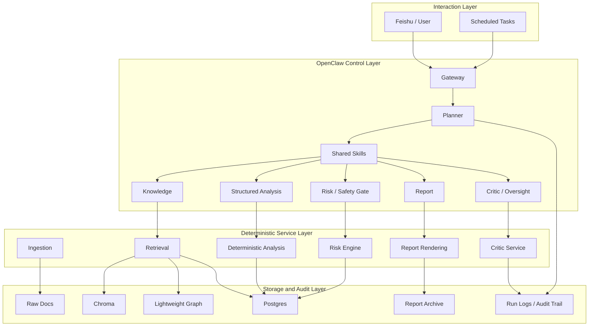

# Ethics-Oriented Project Transformation Plan

## 1. Purpose

This document defines a practical transformation path for the current OpenClaw-based multi-agent project from a finance-first research MVP into an ethics-oriented, evidence-grounded, human-supervised decision support system.

The goal is not to discard the current architecture. The goal is to preserve the existing multi-agent workflow, deterministic services, storage layers, and auditability, while shifting the system emphasis toward:

- evidence grounding
- accountability
- transparency
- risk-aware output
- human-in-the-loop oversight
- bounded autonomy

## 2. Transformation Strategy

### 2.1 Core Direction

The recommended strategy is:

- keep the current OpenClaw-native orchestration structure
- keep deterministic services as the execution backbone
- keep the storage and retrieval stack
- redefine the system as an ethical decision support workflow rather than a finance-first analysis workflow

### 2.2 Why This Strategy

This approach is preferred because the current project already contains most of the mechanisms needed for an ethics-oriented system:

- evidence-backed retrieval
- critic review
- risk gating
- audit and run logs
- human approval boundary potential
- workspace and role separation

The missing work is mainly:

- narrative repositioning
- output contract changes
- oversight strengthening
- architecture labeling and role reinterpretation

## 3. New Project Positioning

### 3.1 Recommended Project Identity

Recommended English positioning:

> An evidence-grounded, risk-aware, human-supervised multi-agent decision support system built on OpenClaw.

Recommended Chinese positioning:

> 一个基于 OpenClaw 的、强调证据约束、风险审查、人工监督与可审计性的多 Agent 决策支持系统。

### 3.2 Recommended Problem Statement

The project should be presented as solving the following problem:

> How can multiple AI agents assist complex analysis tasks without overstepping evidence, bypassing review, or producing unauditable conclusions?

This framing is more aligned with Ethics than a pure “quant research assistant” framing.

## 4. Architecture: What Stays and What Changes

## 4.1 Architecture That Should Be Kept

The following architectural foundations should remain unchanged:

### OpenClaw Control Plane

- `openclaw/workspaces/`
- `openclaw/skills/`
- `openclaw/runtime/`
- planner-first routing
- Feishu entry
- cron entry

Reason:
This layer already provides role separation, routing, and auditable orchestration boundaries.

### Deterministic Service Layer

- `services/ingestion`
- `services/rag`
- `services/planner`
- `services/quant`
- `services/risk`
- `services/report`
- `services/critic`

Reason:
Ethics-oriented systems benefit from deterministic, testable, auditable execution. Moving these into prompt-only logic would reduce trustworthiness.

### Storage and Retrieval Layer

- `Postgres`
- `Lightweight Graph`
- `Chroma`
- raw document files
- run logs and report archive

Reason:
This stack already supports traceability, provenance, retrieval, and auditability.

## 4.2 Architecture That Should Be Modified

The following architectural aspects should be adjusted.

### 1. System Goal Layer

Current orientation:

- research productivity
- quantitative output
- report generation

Target orientation:

- trustworthy decision support
- evidence-constrained reasoning
- accountable multi-agent collaboration
- explicit human oversight

This is a semantic and product-layer change, not a storage or infrastructure rewrite.

### 2. Agent Role Semantics

Current agent names can remain, but their descriptions should change.

#### Planner

Current emphasis:
- routing and task execution

New emphasis:
- accountable coordinator
- boundary enforcer
- final responsibility allocator

#### Knowledge

Current emphasis:
- retrieval and evidence pack

New emphasis:
- evidence agent
- provenance and support checker

#### Quant

Current emphasis:
- finance analysis

New emphasis:
- structured analysis agent
- deterministic numeric evaluator

Note:
The service can stay named `quant`, but documentation should explain that this role represents structured, reproducible numerical analysis rather than free-form advisory output.

#### Risk

Current emphasis:
- risk analytics

New emphasis:
- ethical safety gate
- uncertainty and caution layer

#### Report

Current emphasis:
- report rendering

New emphasis:
- transparent communication layer

#### Critic

Current emphasis:
- quality check

New emphasis:
- review and oversight layer
- ethical constraint enforcement

### 3. Final Output Contract

Current outputs focus on:

- summary
- evidence
- quant result
- risk result

New outputs should always include:

- Evidence Status
- Data Freshness
- Risk Status
- Conflict Disclosure
- Human Approval Requirement
- Accountability Trail

This is one of the most important required changes.

### 4. Review Workflow

Current review:

- critic checks coverage and consistency

Target review:

- critic becomes mandatory for all report-like and recommendation-like outputs
- critic uses a structured ethics checklist
- critic can downgrade outputs from “advisory” to “informational only”

### 5. Recommendation Boundary

Current boundary:

- not always explicitly separated

Target boundary:

- factual summary
- analytical interpretation
- action suggestion

These three must be distinct output layers.

Any suggestion that could influence action should require:

- enough evidence
- explicit risk note
- human approval marker

### 6. Logging and Audit Semantics

Current logs already exist.

New audit semantics should additionally record:

- evidence_count
- evidence_status
- freshness_status
- critic_status
- conflict_detected
- human_approval_required
- action_boundary

This does not require a new storage model. It requires expanded logging payloads.

## 5. Target Architecture After Transformation

## 6. Workstreams

## 6.1 Workstream A: Narrative and Documentation Refactoring

### Objective

Reframe the system from finance-first analysis to ethics-oriented decision support.

### Required Changes

- update `README.md`
- update project overview documents
- update architecture descriptions
- update workspace READMEs and role definitions

### Deliverables

- new project description
- ethics-oriented agent descriptions
- revised architecture narrative

## 6.2 Workstream B: Output Contract Redesign

### Objective

Make every important output transparent, reviewable, and bounded.

### Required Changes

Add structured fields to planner/report/critic outputs:

- `evidence_status`
- `data_freshness`
- `risk_status`
- `conflict_detected`
- `human_approval_required`
- `action_boundary`
- `accountability_trail`

### Deliverables

- updated planner response schema
- updated report schema
- updated critic schema

## 6.3 Workstream C: Critic + Reflection Checklist

### Objective

Make the critic the formal ethics gate.

### Required Changes

Add a structured review checklist such as:

1. Is every key claim supported by evidence?
2. Is the freshness of data explicit?
3. Is there any conflict between analysis and risk outputs?
4. Is the response overstating certainty?
5. Does this output require human approval before action?

### Deliverables

- updated critic service logic
- updated critic output schema
- updated planner/report integration

## 6.4 Workstream D: Human Approval Boundary

### Objective

Ensure the system never presents action-oriented output as if it were automatically authorized.

### Required Changes

Introduce explicit states:

- `informational_only`
- `analysis_only`
- `requires_human_approval`

### Deliverables

- planner-side action boundary tagging
- report-side approval notice
- critic validation against improper action framing

## 6.5 Workstream E: Audit and Accountability Trail

### Objective

Make it clear which agent contributed what and how the final answer was formed.

### Required Changes

Add a standardized accountability trail to final outputs:

- participating agents
- evidence count
- risk gate result
- critic result
- final status

### Deliverables

- planner final output trail
- report section for accountability
- run log extensions

## 7. File-Level Implementation Plan

## 7.1 Files That Should Be Updated First

### Documentation

- `README.md`
- `openclaw-multi-agent-architecture.md`
- `project-plan-quant-research.md`
- `docs/project-system-overview.md`

### Workspace Role Definitions

- `openclaw/workspaces/planner/AGENTS.md`
- `openclaw/workspaces/knowledge/AGENTS.md`
- `openclaw/workspaces/quant/AGENTS.md`
- `openclaw/workspaces/risk/AGENTS.md`
- `openclaw/workspaces/report/AGENTS.md`
- `openclaw/workspaces/critic/AGENTS.md`

### Core Execution Paths

- `services/planner/pipeline.py`
- `services/planner/report_pipeline.py`
- `services/planner/models.py`
- `services/critic/service.py`
- `services/report/service.py`

### Audit and Logging

- `services/common/audit.py`

## 7.2 Files That Can Be Kept with Minimal Change

- `services/ingestion/*`
- `services/rag/*`
- `services/common/graph.py`
- `services/common/repository.py`
- `services/quant/*`
- `services/risk/*`

These layers mostly need semantic reframing, not structural replacement.

## 8. Implementation Phases

## Phase 1: Reframing and Contracts

### Duration

1 to 2 days

### Tasks

- update project positioning
- revise role descriptions
- add ethics metadata to planner/report outputs
- define action boundary states

### Outcome

The project is ethically framed at the product and output level.

## Phase 2: Critic Strengthening

### Duration

1 to 2 days

### Tasks

- add critic reflection checklist
- add conflict disclosure
- enforce approval boundary validation

### Outcome

The critic becomes the formal oversight mechanism.

## Phase 3: Audit and Evaluation

### Duration

1 day

### Tasks

- extend run log schema
- expose ethics-related run metadata
- document evaluation metrics

### Outcome

The project becomes demonstrably auditable and evaluable as an ethics-oriented system.

## 9. Evaluation Framework

Recommended ethics-oriented evaluation dimensions:

### Evidence Coverage Rate

- percentage of major conclusions supported by evidence

### Freshness Transparency Rate

- percentage of outputs explicitly labeling data date and freshness

### Critic Catch Rate

- percentage of weak or unsupported outputs correctly flagged by critic

### Conflict Disclosure Rate

- percentage of inter-agent conflicts explicitly surfaced

### Human Approval Compliance Rate

- percentage of action-like outputs correctly labeled as requiring approval

### Audit Completeness

- percentage of runs with complete accountability trail

## 10. Risks and Mitigations

### Risk 1: Ethics Theme Feels Cosmetic

Mitigation:
- change output contracts, not only documentation
- make critic mandatory
- expose action boundaries visibly

### Risk 2: Project Still Looks Too Finance-Specific

Mitigation:
- describe `quant` as structured analysis, not just alpha-seeking logic
- emphasize evidence, review, and bounded autonomy in all documentation

### Risk 3: Too Much Refactoring

Mitigation:
- preserve service architecture
- focus only on semantics, oversight, logging, and output contracts

## 11. Final Recommendation

The project should not be rebuilt from scratch for an ethics-oriented course direction.

The professional and implementable path is:

1. keep the current OpenClaw-native architecture
2. reinterpret the system as an accountable decision support workflow
3. strengthen critic, transparency, and approval boundaries
4. extend audit semantics
5. present the system as an ethical multi-agent AI workflow rather than a finance-first research assistant

This path is technically feasible, academically coherent, and significantly lower risk than a full theme rewrite.
