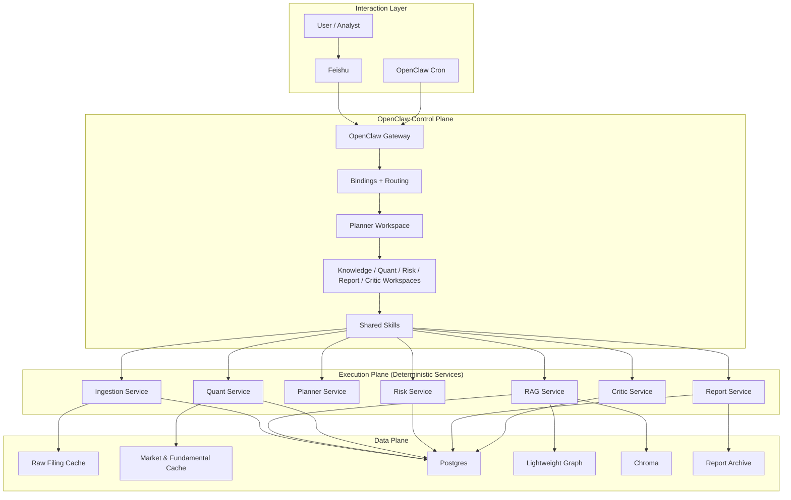
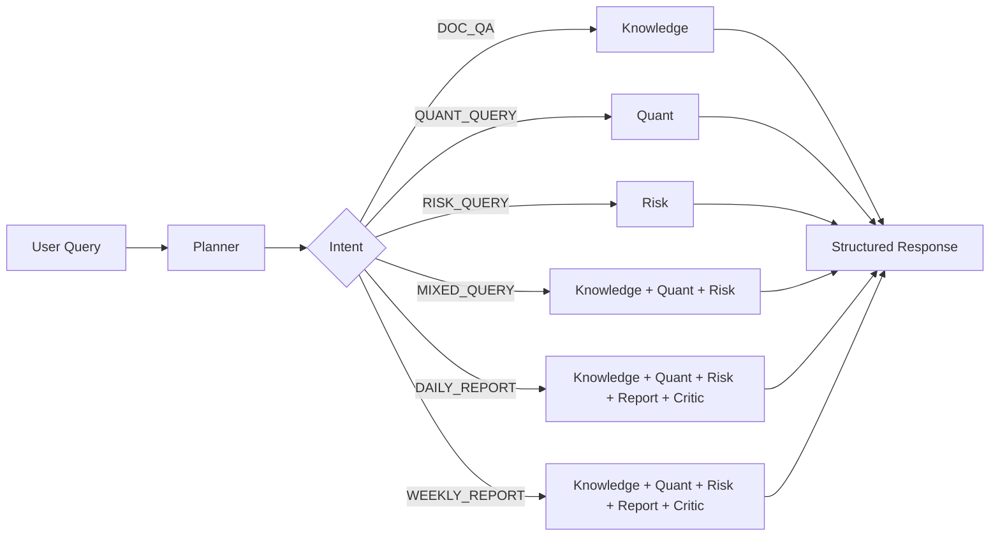
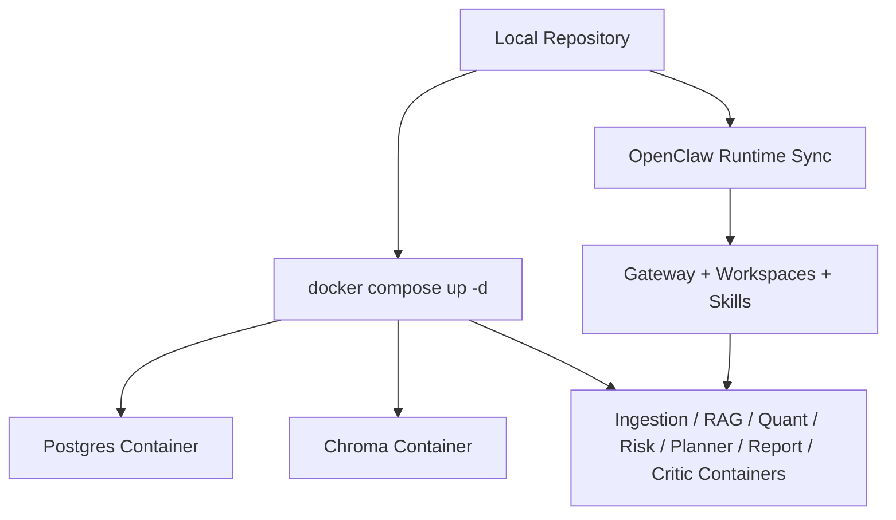

# OpenClaw Multi-Agent Architecture for the US Market Research System

## 1. Overview

This project uses a hybrid multi-agent architecture built on top of OpenClaw.

The architecture is intentionally split into three layers:

- `OpenClaw` as the control plane
- deterministic `FastAPI` services as the execution plane
- `Postgres + Lightweight Graph + Chroma + local caches` as the data plane

This design keeps the project:

- easy to test
- easy to reproduce locally
- explicit about agent responsibilities
- auditable for evidence, review status, and action boundaries

The current project is an English-language US market research system that uses:

- `SEC EDGAR` for public filing ingestion
- `yfinance` for market and fundamental data
- the `Magnificent 7` as the default stock universe

---

## 2. System Architecture

---

## 3. Agent Responsibilities

The current OpenClaw workspaces are:

- `planner`
- `knowledge`
- `quant`
- `risk`
- `report`
- `critic`

These workspaces are defined under:

- `openclaw/workspaces/`
- `openclaw/skills/`
- `openclaw/runtime/`

### Planner

The planner is the only public orchestration entry point.

It is responsible for:

- intent classification
- route selection
- collaboration planning
- final response assembly
- exposing collaboration traces to the caller

### Knowledge

The knowledge agent is responsible for evidence retrieval.

It handles:

- SEC filing retrieval
- graph-aware enrichment
- evidence pack generation
- company and ticker matching
- filing-centered synthesis

### Quant

The quant agent provides structured market and fundamentals analysis.

It handles:

- technical snapshots
- valuation factors
- financial ratios
- industry-relative comparisons
- composite scoring

### Risk

The risk agent provides structured portfolio and market risk checks.

It handles:

- concentration analysis
- beta and drawdown checks
- benchmark-relative alerts
- scenario-style warning signals
- action-boundary escalation

### Report

The report agent generates archive-ready research outputs.

It handles:

- daily report generation
- weekly report generation
- markdown rendering
- evidence and source-date packaging

### Critic

The critic agent is the mandatory review layer before high-value report delivery.

It handles:

- evidence sufficiency review
- freshness review
- consistency review
- overstatement review
- action-boundary recommendation

---

## 4. Implemented Collaboration Paths

The current project already runs explicit collaboration paths instead of a single monolithic prompt.

- `DOC_QA`: `Planner -> Knowledge`
- `QUANT_QUERY`: `Planner -> Quant`
- `RISK_QUERY`: `Planner -> Risk`
- `MIXED_QUERY`: `Planner -> parallel(Knowledge, Quant, Risk)`
- `DAILY_REPORT`: `Planner -> parallel(Knowledge, Quant, Risk) -> Report -> Critic`
- `WEEKLY_REPORT`: `Planner -> Knowledge + Quant + Risk -> Report -> Critic`

This means the project already demonstrates real multi-agent orchestration while still keeping deterministic execution inside services.

---

## 5. Request Execution Flow

---

## 6. Data Model and Storage Strategy

### Postgres

Postgres is the primary structured store.

It keeps:

- documents
- reports
- run logs
- graph entities
- graph relations
- metric snapshots
- risk snapshots

### Lightweight Graph

The graph layer stores entity and relation context for:

- companies
- industries
- themes
- filings
- document links

It is used to enrich retrieval and improve evidence-grounded summaries.

### Chroma

Chroma stores vector indexes for:

- filing chunks
- evidence retrieval
- semantic lookup during document QA and report generation

### Local Caches

The local data directories are still important because deterministic services depend on them.

Typical caches include:

- `data/raw`
- `data/market`
- `data/financials`
- `data/reports`

---

## 7. Data Sources

The current US-market configuration is:

- stock universe: `Magnificent 7`
- filing source: `SEC EDGAR`
- market and fundamental data: `yfinance`
- benchmark: `SPY`

This is a deliberate replacement of the earlier A-share data path.

---

## 8. OpenClaw-Native Design Choices

The project is not a pure prompt-only agent system.

Instead, it uses OpenClaw in a controlled hybrid way:

- `workspaces` define agent roles
- `skills` define tool-calling contracts
- `services` perform deterministic execution

The practical split is:

- planner decides **what should happen**
- skills standardize **how tools are invoked**
- services perform **the actual business logic**

This keeps the project stable enough for:

- reproducible demos
- regression testing
- local Docker-based deployment
- Feishu/OpenClaw interactive use

---

## 9. Governance and Review Layer

The project includes a cross-cutting governance layer rather than a separate governance microservice.

Major outputs are expected to expose:

- `data sources`
- `data date`
- `evidence count`
- `critic status`
- `action boundary`
- `human approval`
- `collaboration path`

The critic layer can only make the final action boundary more restrictive.

This is especially important for:

- daily reports
- weekly reports
- risk-heavy answers
- portfolio-related summaries

---

## 10. Deployment Model

The recommended runtime mode is now Docker-first.

This avoids the older local `dev_up.ps1` host-process path during normal usage.

---

## 11. Current Status

The architecture is already in a stable MVP state for:

- GitHub delivery
- local Docker reproduction
- OpenClaw workspace demonstration
- Feishu-based interactive demos
- evidence-grounded filing summaries
- daily and weekly report generation

The remaining future direction is not a structural rewrite.

Instead, future work would mostly focus on:

- richer OpenClaw runtime-native execution
- stronger skill-based orchestration
- cleaner report diversity and evidence deduplication
- more explicit approval workflows if needed

In short, the current system is already a functional OpenClaw multi-agent research architecture, not just a prototype diagram.
