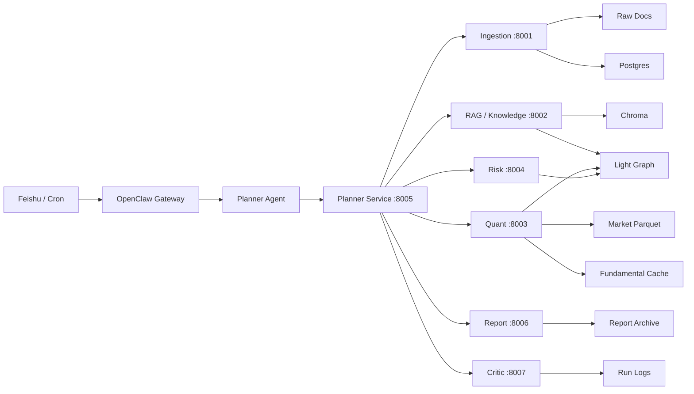

# 项目系统说明

更新时间：2026-04-06

## 1. 项目定位

本项目是一个基于 OpenClaw 的多 Agent 量化投研系统，目标不是自动交易，而是围绕公开信息采集、知识检索、量化分析、风险分析、日报周报生成和飞书问答，形成一个可运行的研究工作台。

当前状态可以定义为：

- 核心 MVP 已完成
- 本地服务链路可运行
- OpenClaw 编排和飞书连接已接入
- 数据层已经升级为 `Postgres + 轻量知识图谱 + Chroma`
- Quant 已从“行情面 MVP”升级到“技术面 + 基本面”组合分析

它还不是完全产品化的生产系统，后续仍需继续补数据覆盖、提升飞书运行稳定性和完善运维自动化。

## 2. 当前完成度

### 2.1 阶段状态

| 阶段 | 状态 | 说明 |
|------|------|------|
| 阶段 0：项目搭建与基础设施 | 已完成 | 工程结构、OpenClaw、Postgres、Chroma、初始化与验收脚本已完成 |
| 阶段 1：采集与 RAG MVP | 已完成 MVP | 新闻/公告采集、原文落盘、索引、检索、Knowledge/Planner DOC_QA 已打通 |
| 阶段 2：Quant / Risk MVP | 已完成增强版 MVP | 技术面、估值因子、财务因子、行业横向比较、组合风险分析均可运行 |
| 阶段 3：报告闭环 | 已完成 MVP | 日报、周报、Critic、本地闭环、OpenClaw 接入已完成 |
| 阶段 4：运行保障 | 部分完成 | 运行日志、重试、重放、告警摘要已完成，更细粒度监控未继续做 |

### 2.2 已完成的关键能力

- OpenClaw 6 Agent 编排
- Feishu 已接入并完成线上回环验证
- 公开新闻 / 公告采集
- 文档检索与证据包生成
- Planner 统一入口
- Quant 技术面 + 基本面组合分析
- Risk 组合风险与回撤分析
- 日报 / 周报 / Critic 本地闭环
- 运行日志、重试、重放

## 3. 系统架构

### 3.1 总体架构

### 3.2 控制面与数据面

- 控制面：OpenClaw Gateway、Feishu 路由、Planner Agent、Cron
- 服务面：`ingestion`、`rag`、`planner`、`quant`、`risk`、`report`、`critic`
- 数据面：原始文档、市场行情 parquet、财务缓存、Postgres、轻量图谱、Chroma、报告归档、运行日志

核心原则是：

- Agent 负责理解、编排、解释
- Python 服务负责确定性逻辑
- 数据层负责存储、索引、审计

## 4. 存储与检索结构

### 4.1 当前采用的三层结构

系统已经采用：

- Postgres：主存储
- 轻量知识图谱：关系层
- Chroma：向量检索层

这三层各自职责不同，不互相替代。

### 4.2 Postgres 主存储

Postgres 负责保存结构化元数据和运行审计，主要包括：

- 文档元数据
- 股票主数据
- 图谱实体与关系表
- 报告索引
- 运行日志
- 指标快照与风险快照

当前已经切回 Postgres 主存储，不再依赖 manifest 作为主路径。

### 4.3 轻量知识图谱

轻量知识图谱目前存储在 Postgres 表结构中，主要包括：

- `entities`
- `relations`
- `document_entities`
- `entity_metric_snapshots`
- `entity_risk_snapshots`

当前已支持的关系包括：

- 公司 -> 公告
- 公司 -> 新闻
- 公司 -> 行业
- 公司 -> 主题
- 文档 -> 实体
- 公司 -> 量化指标快照
- 公司 -> 风险快照

### 4.4 Chroma

Chroma 负责文档 chunk 的向量索引。

当前逻辑是：

- 优先连接 HTTP Chroma：`http://localhost:8000`
- 若 HTTP Chroma 不可用，回退到本地 persistent 目录
- 当前 Docker Chroma 已恢复并重新建索引

## 5. 各模块说明

### 5.1 OpenClaw

相关文件：

- [openclaw.config.json](/D:/yuchangyuan/Documents/openclaw-proj/openclaw.config.json)
- [setup_openclaw_runtime.ps1](/D:/yuchangyuan/Documents/openclaw-proj/scripts/setup_openclaw_runtime.ps1)
- [AGENT.md](/D:/yuchangyuan/Documents/openclaw-proj/agents/planner/AGENT.md)

用途：

- 管理 6 个 Agent 工作区
- 绑定 Feishu 到 `planner`
- 同步定时任务
- 驱动 OpenClaw 运行态与项目对齐

当前运行特点：

- 飞书消息统一进入 `planner`
- 目标路径是优先调用本地 `planner` HTTP 服务
- 运行态底层仍通过 `exec` 启动桥接脚本，而不是原生 HTTP tool

### 5.2 Planner

相关文件：

- [router.py](/D:/yuchangyuan/Documents/openclaw-proj/services/planner/router.py)
- [pipeline.py](/D:/yuchangyuan/Documents/openclaw-proj/services/planner/pipeline.py)
- [report_pipeline.py](/D:/yuchangyuan/Documents/openclaw-proj/services/planner/report_pipeline.py)
- [call_planner_service.py](/D:/yuchangyuan/Documents/openclaw-proj/scripts/call_planner_service.py)

用途：

- 统一接收用户问题和定时任务
- 意图识别
- 路由 `DOC_QA / DAILY_REPORT / WEEKLY_REPORT`
- 汇总 Knowledge / Quant / Risk / Report / Critic 输出

当前接口：

- `GET /health`
- `POST /api/v1/planner/classify`
- `POST /api/v1/planner/query`
- `POST /api/v1/planner/daily-report`
- `POST /api/v1/planner/weekly-report`
- `POST /api/v1/planner/run-logs`
- `POST /api/v1/planner/run-logs/replay`
- `POST /api/v1/planner/alerts/summary`

### 5.3 Ingestion

相关文件：

- [service.py](/D:/yuchangyuan/Documents/openclaw-proj/services/ingestion/service.py)
- [providers.py](/D:/yuchangyuan/Documents/openclaw-proj/services/ingestion/providers.py)
- [state.py](/D:/yuchangyuan/Documents/openclaw-proj/services/ingestion/state.py)

用途：

- 采集新闻与公告
- 原文落盘
- 去重
- 写入文档元数据
- 支持目标池增量采集和按股票代码定向补采

当前已接入数据源：

- Eastmoney 新闻
- 10jqka 新闻
- Sina Finance 新闻
- Eastmoney 公告
- SSE / SZSE 公告补充路径

### 5.4 RAG / Knowledge

相关文件：

- [service.py](/D:/yuchangyuan/Documents/openclaw-proj/services/rag/service.py)
- [chroma_client.py](/D:/yuchangyuan/Documents/openclaw-proj/services/rag/chroma_client.py)
- [knowledge_pipeline.py](/D:/yuchangyuan/Documents/openclaw-proj/services/rag/knowledge_pipeline.py)

用途：

- 文档切分
- 向量索引
- 关键词 + 向量混合检索
- 生成 Evidence Pack
- 输出带证据编号的问答结果

当前实现特点：

- stock-aware retrieval
- 公司词项过滤
- 图谱上下文增强
- Chroma HTTP / persistent 双后端容错

### 5.5 Quant

相关文件：

- [market_data.py](/D:/yuchangyuan/Documents/openclaw-proj/services/quant/market_data.py)
- [fundamentals.py](/D:/yuchangyuan/Documents/openclaw-proj/services/quant/fundamentals.py)
- [service.py](/D:/yuchangyuan/Documents/openclaw-proj/services/quant/service.py)
- [akshare_fetcher.py](/D:/yuchangyuan/Documents/openclaw-proj/services/quant/akshare_fetcher.py)

用途：

- 读取本地行情 parquet
- 抓取并缓存财务数据
- 输出 daily summary / factor / batch hist
- 生成技术面 + 基本面 + 估值面组合分析

当前已实现：

- 技术面
  - 收盘价、涨跌幅、均线、MA signal
  - `momentum_1m`
  - `momentum_3m`
  - `volatility_1m`
  - `price_rank_1y`
- 估值因子
  - `pe_ttm`
  - `pb`
  - `market_cap`
- 财务因子
  - `roe`
  - `gross_margin`
  - `net_margin`
  - `revenue_growth`
  - `net_profit_growth`
  - `debt_to_asset`
  - `current_ratio`
  - `quick_ratio`
- 行业横向比较
  - `industry_pe_percentile`
  - `industry_pb_percentile`
  - `industry_roe_percentile`
  - `industry_revenue_growth_percentile`
- 组合分析
  - `technical_score`
  - `fundamental_score`
  - `valuation_score`
  - `composite_score`
  - `composite_signal`

当前数据来源：

- 行情：本地 parquet + Akshare 补采
- 基本面：Akshare + 本地缓存 [data/financials](/D:/yuchangyuan/Documents/openclaw-proj/data/financials)

### 5.6 Risk

相关文件：

- [service.py](/D:/yuchangyuan/Documents/openclaw-proj/services/risk/service.py)

用途：

- 组合风险检查
- 个股回撤分析
- 行业暴露分析

当前已实现：

- 年化波动
- 最大回撤
- beta
- 行业暴露
- 场景损失估算
- 个股 drawdown

### 5.7 Report

相关文件：

- [service.py](/D:/yuchangyuan/Documents/openclaw-proj/services/report/service.py)
- [daily_report.md](/D:/yuchangyuan/Documents/openclaw-proj/templates/daily_report.md)
- [weekly_report.md](/D:/yuchangyuan/Documents/openclaw-proj/templates/weekly_report.md)

用途：

- 生成日报和周报
- 报告归档
- 输出适合飞书展示的摘要

### 5.8 Critic

相关文件：

- [service.py](/D:/yuchangyuan/Documents/openclaw-proj/services/critic/service.py)

用途：

- 对报告进行覆盖率、时效性、一致性校验

当前输出：

- `PASS`
- `PASS_WITH_WARNINGS`
- `FAIL`

## 6. 数据目录说明

- [data/raw](/D:/yuchangyuan/Documents/openclaw-proj/data/raw)
  - 新闻 / 公告原始 JSON
- [data/market](/D:/yuchangyuan/Documents/openclaw-proj/data/market)
  - 行情 parquet
- [data/financials](/D:/yuchangyuan/Documents/openclaw-proj/data/financials)
  - 财务与估值缓存
- [data/chroma](/D:/yuchangyuan/Documents/openclaw-proj/data/chroma)
  - 本地 Chroma fallback 目录
- [data/reports](/D:/yuchangyuan/Documents/openclaw-proj/data/reports)
  - 日报 / 周报归档
- [data/metadata](/D:/yuchangyuan/Documents/openclaw-proj/data/metadata)
  - manifest 与补充元数据

## 7. 测试与验证

当前主要测试文件：

- [test_phase0_smoke.py](/D:/yuchangyuan/Documents/openclaw-proj/tests/test_phase0_smoke.py)
- [test_stage1_knowledge_pipeline.py](/D:/yuchangyuan/Documents/openclaw-proj/tests/test_stage1_knowledge_pipeline.py)
- [test_stage1_planner_pipeline.py](/D:/yuchangyuan/Documents/openclaw-proj/tests/test_stage1_planner_pipeline.py)
- [test_stage2_quant_risk.py](/D:/yuchangyuan/Documents/openclaw-proj/tests/test_stage2_quant_risk.py)
- [test_quant_fundamentals.py](/D:/yuchangyuan/Documents/openclaw-proj/tests/test_quant_fundamentals.py)
- [test_stage3_report_critic.py](/D:/yuchangyuan/Documents/openclaw-proj/tests/test_stage3_report_critic.py)
- [test_stage4_run_logs.py](/D:/yuchangyuan/Documents/openclaw-proj/tests/test_stage4_run_logs.py)

最近一次与本轮改动直接相关的结果：

- Quant + 基本面 + 行业比较 + smoke：`20 passed`

## 8. 当前已知限制

### 8.1 数据覆盖

- 目标池外和部分目标池内股票的公告覆盖仍然不够
- 行业横向比较依赖同一行业股票的基本面缓存数量
- 文档问答质量仍然先受采集覆盖约束

### 8.2 飞书链路稳定性

- Feishu 已完成回环验证
- 但飞书消息能否稳定命中本地 `planner` HTTP 服务，仍依赖 `8005` 服务在线
- 若 `planner` HTTP 未在线，OpenClaw embedded agent 可能走兜底路径，导致回复与本地服务结果不一致

### 8.3 OpenClaw 运行限制

- 当前 OpenClaw 版本没有把 `services.baseUrl` 暴露成原生 HTTP 工具
- 所以运行态仍通过 `exec` 启动 [call_planner_service.py](/D:/yuchangyuan/Documents/openclaw-proj/scripts/call_planner_service.py) 作为桥接

## 9. 后续建议

建议按下面顺序继续完善：

### 9.1 第一优先级：补数据覆盖

- 增加更多公告源与新闻源
- 继续强化按股票代码定向补采
- 为目标股票池持续回填基本面缓存

### 9.2 第二优先级：稳定飞书运行态

- 固化本地服务启动与保活脚本
- 保证 `planner` HTTP 服务在线
- 禁止在本地服务不可用时走误导性的搜索兜底回复

### 9.3 第三优先级：继续增强 Quant

- 扩充估值与财务口径
- 增加更多行业覆盖
- 加入更细粒度的多因子排序与评分解释

## 10. 结论

截至 2026-04-06，这个项目已经是一个可运行的多 Agent 投研系统 MVP，而不再是纯脚手架。

它已经具备：

- OpenClaw + Feishu 接入
- 文档采集、索引、问答
- 技术面 + 基本面 Quant 分析
- Risk、Report、Critic 闭环
- Postgres + 轻量知识图谱 + Chroma 三层数据结构

下一步的重点，不再是从 0 到 1，而是：

- 从 MVP 走向更稳定的数据覆盖
- 从本地可运行走向更稳的线上运行
- 从基础分析走向更完整的研究能力
