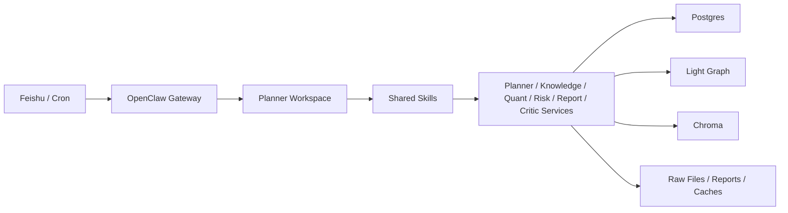

# 项目系统说明

## 1. 项目定位

本项目是一个基于 OpenClaw 编排的多 Agent 股票投研系统，面向公开市场信息研究，不面向自动交易执行。

当前版本已经从“OpenClaw 作为消息入口，Python 服务作为主体”的结构，收敛为更明确的三层架构：

- 共享业务服务层：负责确定性计算、数据采集、存储与检索
- OpenClaw 工作空间层：负责 Agent 角色边界、任务协作、调度与交互入口
- Skills 层：负责跨 Agent 复用的服务调用契约与操作规范

## 2. 当前完成度

当前项目状态：

- 阶段 0：完成
- 阶段 1：完成 MVP
- 阶段 2：完成 MVP，并已补入技术面 + 基本面能力
- 阶段 3：完成本地日报 / 周报闭环
- 阶段 4：完成基础运行日志、重试和回放能力

OpenClaw 架构改造完成的部分：

- 已新增 `openclaw/workspaces/`，按角色拆分工作空间
- 已新增 `openclaw/skills/`，抽离共享服务调用规范
- 已新增 `openclaw/runtime/`，统一运行态同步入口
- 已将 `openclaw.config.json` 的 agentDir 切到 `openclaw/workspaces/*`
- 已将运行态同步脚本切到从 `openclaw/workspaces/*` 同步工作空间
- 已将 `planner` 的主流程收敛为显式协作 contract，而不是继续直接内嵌所有业务调用

当前仍然保留的工程现实：

- 当前业务主逻辑仍然主要在 `services/` 中执行
- 当前 OpenClaw 仍然通过“Agent + skill/脚本桥接 + 本地 HTTP 服务”运行，而不是完全把业务逻辑上移到 prompt 中

当前已经落地的协作主路径：

- `DOC_QA`: `Planner -> Knowledge`
- `QUANT_QUERY`: `Planner -> Quant`
- `RISK_QUERY`: `Planner -> Risk`
- `DAILY_REPORT`: `Planner -> Knowledge + Quant + Risk -> Report -> Critic`
- `WEEKLY_REPORT`: `Planner -> Knowledge + Quant + Risk -> Report -> Critic`

## 3. 新架构总览

### 3.1 三层结构

### 3.2 设计原则

- OpenClaw 负责角色边界、协作和调度
- Services 负责稳定、可测试、可审计的业务实现
- Skills 负责把服务调用规范化，避免各 Agent 在 prompt 中重复描述调用方式
- Workspace 负责约束各 Agent 的职责，而不是承载全部代码

## 4. 目录说明

### 4.1 共享业务层

- `services/`
  - `ingestion`：新闻 / 公告采集
  - `rag`：索引、切分、检索、evidence pack
  - `planner`：统一入口、任务编排
  - `quant`：技术面、估值、财务因子、组合评分
  - `risk`：风险检查、暴露、回撤、场景损失
  - `report`：日报 / 周报生成
  - `critic`：报告校验与质量检查
- `scripts/`
  - 初始化、同步、验证、demo、回填脚本
- `templates/`
  - 日报 / 周报模板
- `tests/`
  - smoke、阶段回归、检索与量化测试

### 4.2 OpenClaw 原生编排层

- `openclaw/workspaces/`
  - `planner`
  - `knowledge`
  - `quant`
  - `risk`
  - `report`
  - `critic`

每个 workspace 下包含：

- `AGENTS.md`
  - 角色职责
  - 调用顺序
  - 输出约束
  - 禁止事项
- `README.md`
  - workspace 说明和边界
- `playbooks/`
  - 固定工作流说明

### 4.3 Skills 层

- `openclaw/skills/planner-query`
- `openclaw/skills/knowledge-retrieve`
- `openclaw/skills/quant-analysis`
- `openclaw/skills/risk-analysis`
- `openclaw/skills/report-build`
- `openclaw/skills/critic-review`
- `openclaw/skills/ingest-trigger`
- `openclaw/skills/runlog-inspect`

这些 skills 当前主要表达：

- 服务调用入口
- 输入输出契约
- 失败时的降级要求
- 常见调用模式

### 4.4 运行态层

- `openclaw.config.json`
  - 项目侧 OpenClaw 配置源
- `openclaw/runtime/bootstrap.ps1`
  - 运行态同步入口
- `scripts/setup_openclaw_runtime.ps1`
  - 实际执行同步、绑定、cron 配置的脚本

## 5. Agent 角色边界

### Planner

- 唯一用户入口
- 负责意图识别和任务路由
- 优先通过 skill 或本地 planner HTTP 服务调度下游
- 不应直接承担大量领域计算

### Knowledge

- 负责文档检索和证据组织
- 聚焦 RAG、图谱上下文、evidence pack

### Quant

- 负责技术面、估值、财务因子和行业比较
- 输出组合评分与解释

### Risk

- 负责风险计算与组合暴露分析

### Report

- 负责日报 / 周报组装与归档

### Critic

- 负责质量校验、覆盖率、时效性和一致性检查

## 6. 数据与存储结构

### 6.1 主存储

项目当前采用 `Postgres + 轻量知识图谱 + Chroma` 三层结构：

- Postgres
  - 文档元数据
  - 报告索引
  - 运行日志
  - 图谱实体与关系
  - 指标快照和风险快照
- 轻量知识图谱
  - `entities`
  - `document_entities`
  - `relations`
  - `entity_metric_snapshots`
  - `entity_risk_snapshots`
- Chroma
  - 文档 chunk 向量索引
  - 混合检索中的语义召回层

### 6.2 文件存储

- `data/raw/`
  - 原始新闻 / 公告正文
- `data/market/`
  - 市场行情 parquet
- `data/financials/`
  - 基本面缓存
- `data/reports/`
  - 报告归档
- `data/chroma/`
  - Chroma 本地持久化回退目录

## 7. 与旧结构的关系

### 7.1 为什么保留 `services/`

当前项目没有把业务逻辑搬进 Agent prompt，而是保留在 `services/`，原因是：

- 便于测试
- 便于 CI
- 便于本地排障
- 数值计算和检索逻辑更适合保留为确定性服务

### 7.2 旧兼容层已删除

旧的 `agents/` 兼容目录已经移除，当前仓库只保留新的 OpenClaw 原生结构：

- `openclaw/workspaces/`
- `openclaw/skills/`
- `openclaw/runtime/`

这意味着仓库内的角色定义来源已经统一，不再同时维护两套 Agent prompt 目录。

## 8. 现在为什么更像 OpenClaw 项目

改造前：

- OpenClaw 主要负责 Feishu 接入和 cron
- 业务主流程更多由本地脚本和服务直接驱动

改造后：

- OpenClaw 明确拥有角色层
- Workspace 成为角色定义的主入口
- Skills 成为跨角色复用能力的主入口
- runtime bootstrap 成为运行态同步的统一入口

也就是说，当前架构已经从“OpenClaw 接入的系统”进一步收敛为“以 OpenClaw 为编排层的系统”。

## 9. 当前限制

虽然架构已经更贴近 OpenClaw-native，但当前仍有这些限制：

- 业务计算仍以本地服务为主，而不是原生 Agent 推理流
- 飞书消息稳定性仍依赖本地 `planner` HTTP 服务在线
- 一些运行态执行仍通过脚本桥接，而不是纯 skill 工具调用
- 运行态执行仍然依赖本地服务在线，而不是纯 Agent 工具链

## 10. 后续建议

推荐后续继续按下面顺序推进：

1. 让 Planner 默认只通过 skills 调服务，减少 prompt 内自由发挥
2. 收紧 Feishu 线上兜底逻辑，服务不可用时直接报明确错误
3. 为每个 workspace 增补更完整的 playbooks
4. 将更多运行检查、告警、回放动作迁到 skills
5. 继续减少脚本桥接，向更稳定的 skill 调用收敛

## 11. 结论

当前项目已经完成从“服务主导、OpenClaw 接入”到“服务主导、OpenClaw 编排”的第一阶段重构。

它仍然保留了 Python 服务层的工程稳定性，但现在已经具备了：

- 基于 Workspace 的角色边界
- 基于 Skills 的能力复用
- 基于 Runtime Bootstrap 的运行态同步

这使它更适合作为一个“基于 OpenClaw 框架实现的多 Agent 投研项目”进行展示和后续扩展。
