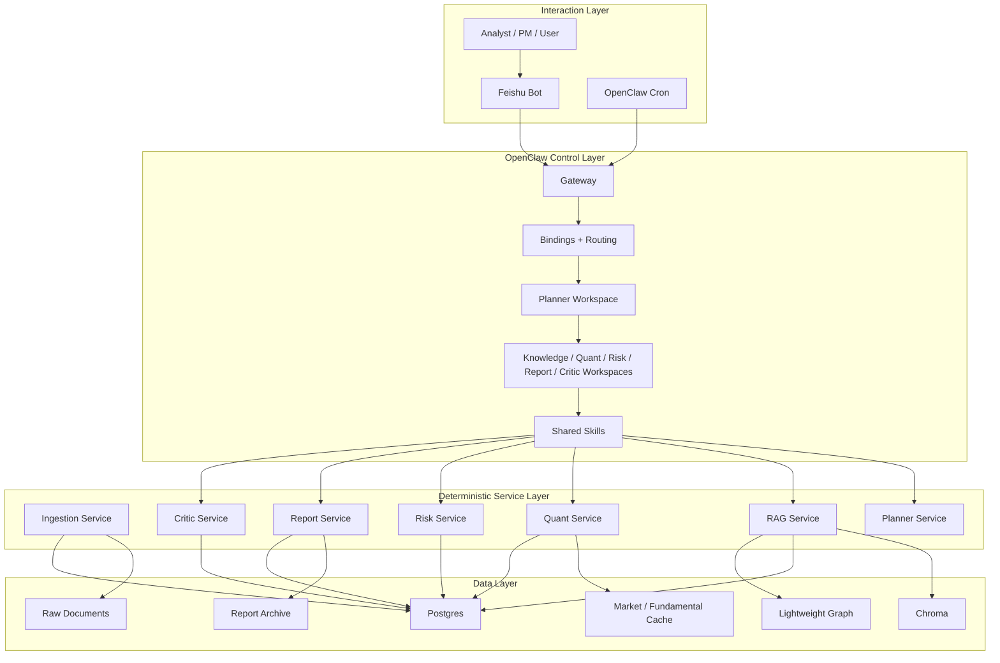
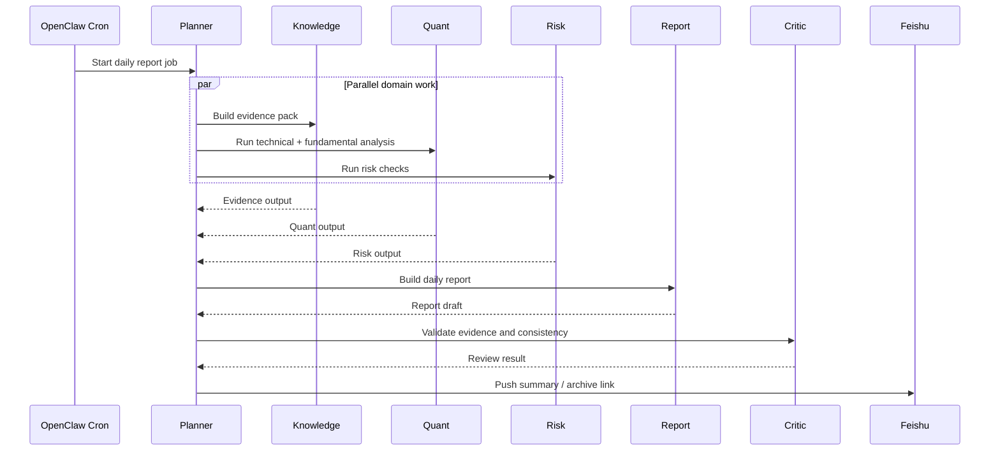
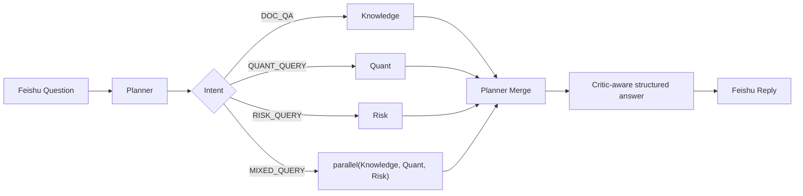

# OpenClaw Multi-Agent Architecture for Quant Research

## Positioning

This project is now a working OpenClaw-based research system rather than a pure architecture proposal.

The implemented pattern is:

- OpenClaw is the control plane
- deterministic Python services are the execution plane
- Postgres, Lightweight Graph, and Chroma form the storage and retrieval plane

This means:

- OpenClaw handles Feishu entry, cron scheduling, workspace isolation, agent instructions, and orchestration boundaries
- business correctness stays in auditable services under `services/`
- agent outputs are grounded by evidence, structured calculations, and run logs

## Current Architecture Decision

The project uses a pragmatic OpenClaw-native hybrid model.

### What OpenClaw owns

- inbound routing from Feishu
- cron-triggered daily and weekly jobs
- workspace-level role boundaries
- skill-level shared invocation contracts
- planner-first orchestration

### What services own

- ingestion and parsing
- indexing and retrieval
- quantitative computation
- risk computation
- report rendering
- critic validation

### Why this split was chosen

- more stable than putting all business logic into prompts
- easier to test and reproduce
- easier to audit
- still compatible with future deeper `sessions_spawn` runtime orchestration

## Implemented Agent Map

The current repository and runtime both use six core OpenClaw workspaces:

- `planner`
- `knowledge`
- `quant`
- `risk`
- `report`
- `critic`

These definitions live under:

- `openclaw/workspaces/`
- `openclaw/skills/`
- `openclaw/runtime/`

The old `agents/` compatibility layer has been removed from the repository.

## Current Responsibility Split

### Planner

Responsibility:

- single public entrypoint
- intent classification
- route selection
- collaboration assembly
- final answer and report handoff

Current routing paths:

- `DOC_QA`: `Planner -> Knowledge`
- `QUANT_QUERY`: `Planner -> Quant`
- `RISK_QUERY`: `Planner -> Risk`
- `MIXED_QUERY`: `Planner -> parallel(Knowledge, Quant, Risk)`
- `DAILY_REPORT`: `Planner -> parallel(Knowledge, Quant, Risk) -> Report -> Critic`
- `WEEKLY_REPORT`: `Planner -> Knowledge + Quant + Risk -> Report -> Critic`

### Knowledge

Responsibility:

- retrieval planning
- evidence-pack building
- graph-context expansion
- evidence-backed synthesis

### Quant

Responsibility:

- technical indicators
- valuation factors
- financial factors
- industry-relative comparison
- composite scoring

### Risk

Responsibility:

- volatility
- drawdown
- beta
- exposure
- scenario loss analysis

### Report

Responsibility:

- daily report generation
- weekly report generation
- archive-ready markdown rendering

### Critic

Responsibility:

- evidence coverage checks
- freshness checks
- consistency checks between narrative and numeric outputs

## System Layers

## Current Storage and Retrieval Model

The implemented storage model is no longer the earlier "metadata + optional graph" sketch. It is now:

- `Postgres`
  - documents
  - reports
  - run logs
  - graph entities
  - graph relations
  - metric snapshots
  - risk snapshots
- `Lightweight Knowledge Graph`
  - built on top of Postgres tables
  - entity-oriented context expansion for retrieval and answer synthesis
- `Chroma`
  - vector search for indexed document chunks
  - HTTP backend first
  - local persistence fallback supported

## Runtime Orchestration Model

The current project does not force every path through raw OpenClaw-native `sessions_spawn`.

Instead it uses a staged approach:

### Already implemented

- workspace-level role separation
- skill-level reusable service contracts
- planner-led delegated orchestration
- runtime-level parallel sub-agent style collaboration for:
  - `MIXED_QUERY`
  - `DAILY_REPORT`

### Not fully implemented yet

- broad direct use of OpenClaw `sessions_spawn` for all multi-agent paths
- runtime-only execution without service-side orchestration contracts
- an `ops` workspace for administration and repair workflows

This is intentional. The project currently optimizes for reproducibility and stability rather than maximum agent autonomy.

## Daily Report Runtime Flow

## Mixed Question Runtime Flow

## OpenClaw-Specific Design Rules

### 1. Planner-first entry

All Feishu inbound messages and cron jobs enter through `planner`.

### 2. Services remain deterministic

Quant, risk, indexing, and report rendering stay out of prompt-only logic.

### 3. Skills define reusable contracts

Shared service invocation rules live under:

- `openclaw/skills/planner-query`
- `openclaw/skills/knowledge-retrieve`
- `openclaw/skills/quant-analysis`
- `openclaw/skills/risk-analysis`
- `openclaw/skills/report-build`
- `openclaw/skills/critic-review`
- `openclaw/skills/ingest-trigger`
- `openclaw/skills/runlog-inspect`

### 4. Workspace instructions define boundaries

Role-specific behavior and playbooks live under:

- `openclaw/workspaces/*/AGENTS.md`
- `openclaw/workspaces/*/playbooks/`

### 5. Stable before fully autonomous

The current architecture intentionally prefers:

- planner-side parallel orchestration
- deterministic service contracts
- explicit run logs

over:

- free-form cross-agent reasoning loops
- heavy prompt-only orchestration

## Current Status vs Original Vision

The project is now aligned with the original architecture in its main structural ideas:

- OpenClaw as control plane
- planner as single entrypoint
- multiple role-specific workspaces
- cron-driven scheduled workflows
- deterministic services for correctness

The main remaining gap is depth of runtime-native sub-agent execution.

Current state:

- enough for a working OpenClaw-based project
- stable for local use, demos, and GitHub submission
- not yet the final "all-important paths use raw `sessions_spawn`" architecture

## Recommended Next Step

No immediate redesign is required for MVP delivery.

If the project later needs a stronger OpenClaw-native identity, the next upgrade should be:

1. move `MIXED_QUERY` from planner-side parallel contracts to direct runtime `sessions_spawn`
2. move `DAILY_REPORT` orchestration to explicit sub-agent runs in the OpenClaw runtime
3. keep deterministic services as the execution backends

This preserves current correctness while increasing visible agent collaboration.
