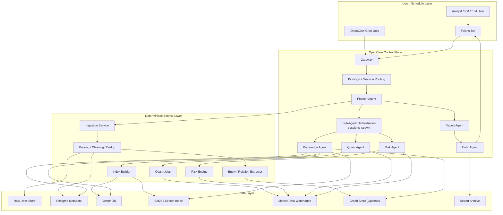
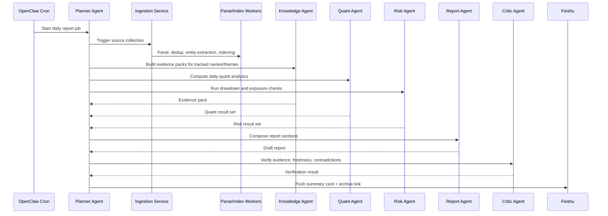
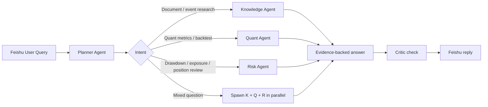
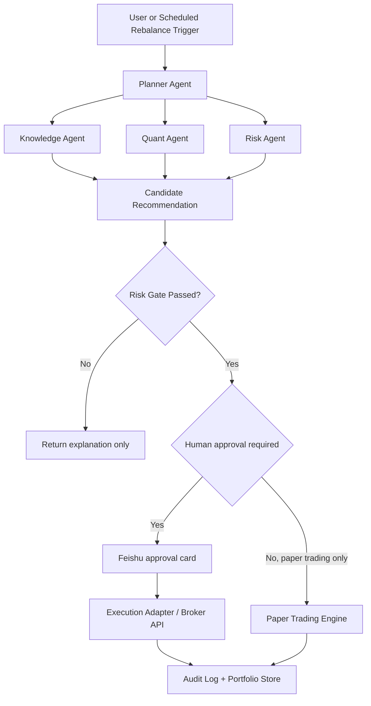

# OpenClaw Multi-Agent Architecture for Quant Research

## Positioning

Use OpenClaw as the control plane, not the data plane.

- OpenClaw handles agent isolation, routing, scheduled runs, channel delivery, and user interaction.
- External services handle crawling, parsing, indexing, quantitative computation, and risk checks.
- Reports and Q&A are generated by agents, but their evidence and calculations come from deterministic services.

This keeps the system auditable and reduces hallucination risk in research and portfolio workflows.

## Why OpenClaw Fits

OpenClaw provides the pieces you need for this kind of system:

- Isolated agents with separate workspaces, sessions, auth, and tool policies
- Deterministic inbound routing via bindings
- Background sub-agents via `sessions_spawn`
- Built-in cron scheduling in the gateway
- Feishu channel integration over long WebSocket connection
- Per-agent sandbox and tool restrictions
- Delegate-style deployment model for an organizational assistant

## Recommended Agent Map

### 1. Planner Agent

Responsibility:

- Entry point for scheduled jobs and Feishu questions
- Intent classification
- Task decomposition
- Calling worker agents or external services

Should not do:

- Heavy data collection
- Index building
- Quant backtests

### 2. Knowledge Agent

Responsibility:

- RAG query planning
- Dense + BM25 + metadata filter retrieval
- Evidence pack generation
- Cross-document synthesis

Should consume:

- Parsed documents
- Vector index
- Keyword index
- Optional graph expansion results

### 3. Quant Agent

Responsibility:

- Fetch structured market and fundamental data
- Run deterministic analytics and backtests
- Produce factor, signal, attribution, and market state outputs

Should rely on:

- Python jobs and libraries like Akshare
- Versioned analysis scripts
- A structured warehouse

### 4. Risk Agent

Responsibility:

- Max drawdown analysis
- Exposure checks
- Position constraint validation
- Scenario and stress analysis

This replaces the vague `Fallback Agent`. In this domain, risk is not a fallback path. It is a first-class gate.

### 5. Report Agent

Responsibility:

- Assemble daily and weekly reports
- Convert evidence packs and quant outputs into readable structure
- Produce Feishu-friendly summary and full archive version

### 6. Critic Agent

Responsibility:

- Check whether each claim has evidence
- Check whether qualitative narrative conflicts with quant output
- Check timestamp freshness and missing disclosures

## System Layers



## How to Implement This in OpenClaw

### A. Use one Gateway, multiple isolated agents

Each OpenClaw agent should have:

- Its own workspace
- Its own `agentDir`
- Its own session history
- Its own tool policy
- Optional sandbox isolation

Suggested logical agents:

- `planner`
- `knowledge`
- `quant`
- `risk`
- `report`
- `critic`
- `ops` for admin or repair tasks

Do not collapse all logic into one agent. You will lose observability and boundary control.

### B. Route all inbound traffic through Planner

Use OpenClaw bindings so Feishu inbound messages and cron jobs reach the `planner` agent first.

The planner then decides:

- answer directly
- spawn sub-agents
- call deterministic services
- request approval for sensitive operations

This keeps user-facing behavior consistent and avoids cross-agent routing ambiguity.

### C. Use `sessions_spawn` for bounded parallel work

Use sub-agents only for tasks that are:

- parallelizable
- time-bounded
- independently inspectable

Good examples:

- one sub-agent gathers evidence for a company
- one sub-agent runs sector-level quant checks
- one sub-agent validates risk exposure

Bad examples:

- long-lived ETL pipelines
- persistent index building
- database maintenance

Those belong in external workers, not sub-agents.

### D. Use cron as the scheduling entrypoint

Cron should trigger:

- daily ingestion kickoffs
- daily report generation
- weekly summary generation
- market-open and market-close monitoring
- exception alerts

Use isolated cron sessions for report-generation tasks so each run is auditable and does not pollute the main chat session.

### E. Use Feishu only as the interaction channel

Feishu should handle:

- analyst questions
- report delivery
- alert delivery
- approval steps for future rebalance operations

It should not be the source of truth for research data or workflow state.

## Daily Run Orchestration



## Interactive Q&A Orchestration



## Future Portfolio Adjustment Architecture

This should be a later stage, not day one.



## OpenClaw-Specific Design Rules

### 1. Control plane vs data plane

OpenClaw manages orchestration. Your data platform manages correctness.

### 2. One public entrypoint

All Feishu traffic and scheduled reports enter through `planner`.

### 3. Hard tool boundaries

Suggested boundaries:

- `planner`: can use session tools, message, cron, limited service calls
- `knowledge`: retrieval tools, no database admin, no execution privileges beyond retrieval wrappers
- `quant`: execution allowed only for approved analysis scripts or containers
- `risk`: same as quant, but no channel send
- `report`: no raw ETL tools
- `critic`: read-only plus retrieval

### 4. Sandbox risky agents

Quant and risk agents should run with stronger sandboxing because they touch code execution and possibly credentials.

### 5. Use delegate model for enterprise rollout

If this serves a team, deploy it as a delegate-style organizational assistant:

- the bot has its own identity
- it operates under explicit permissions
- it follows standing orders
- all actions are auditable

### 6. Put standing orders in agent instructions

Critical standing orders:

- never make unsupported claims without evidence
- never use stale data without labeling the timestamp
- never recommend automatic portfolio changes without passing risk gates
- never execute trades directly without explicit approval path

## Minimal Viable Build Order

### Phase 1

- Feishu bot connected to OpenClaw
- Single `planner` agent
- External ingestion + RAG service
- External quant analysis service
- Daily report push
- Basic research Q&A

### Phase 2

- Split out `knowledge`, `quant`, and `risk`
- Add `critic`
- Add weekly summary
- Add factor dashboards and attribution

### Phase 3

- Add optional graph augmentation
- Add position diagnostics
- Add approval workflow in Feishu
- Add paper-trading rebalancer

### Phase 4

- Human-in-the-loop rebalance proposals
- Broker or OMS adapter
- Full audit and policy engine

## Suggested OpenClaw Config Shape

This is illustrative, not production-ready:

```json
{
  "agents": {
    "defaults": {
      "tools": { "profile": "coding" },
      "subagents": {
        "maxSpawnDepth": 2,
        "maxChildrenPerAgent": 6,
        "maxConcurrent": 8,
        "runTimeoutSeconds": 900
      }
    },
    "list": [
      {
        "id": "planner",
        "default": true,
        "workspace": "~/.openclaw/workspace-planner"
      },
      {
        "id": "knowledge",
        "workspace": "~/.openclaw/workspace-knowledge",
        "tools": {
          "allow": ["read", "web_search", "web_fetch", "sessions_history"],
          "deny": ["exec", "apply_patch"]
        }
      },
      {
        "id": "quant",
        "workspace": "~/.openclaw/workspace-quant",
        "sandbox": {
          "mode": "all",
          "scope": "agent"
        }
      },
      {
        "id": "risk",
        "workspace": "~/.openclaw/workspace-risk",
        "sandbox": {
          "mode": "all",
          "scope": "agent"
        }
      },
      {
        "id": "report",
        "workspace": "~/.openclaw/workspace-report"
      },
      {
        "id": "critic",
        "workspace": "~/.openclaw/workspace-critic",
        "tools": {
          "allow": ["read", "sessions_history"],
          "deny": ["exec", "write", "apply_patch"]
        }
      }
    ]
  },
  "bindings": [
    {
      "agentId": "planner",
      "match": { "channel": "feishu", "accountId": "main" }
    }
  ],
  "channels": {
    "feishu": {
      "enabled": true,
      "defaultAccount": "main",
      "accounts": {
        "main": {
          "appId": "cli_xxx",
          "appSecret": "xxx",
          "name": "Quant Research Bot"
        }
      },
      "streaming": true,
      "blockStreaming": true
    }
  },
  "cron": {
    "enabled": true,
    "maxConcurrentRuns": 1
  }
}
```

## Final Recommendation

The correct OpenClaw implementation pattern is:

1. `OpenClaw Gateway` as the unified entrypoint
2. `Planner Agent` as the single orchestration brain
3. `sessions_spawn` for parallel agent work
4. `cron` for recurring reports and maintenance workflows
5. `Feishu` as the delivery and approval surface
6. External services for crawling, indexing, quant, and risk
7. Strict risk gates before any future position adjustment

If you keep these boundaries, this system can start as a report-and-QA assistant and later extend into a supervised portfolio decision platform without a full rewrite.
