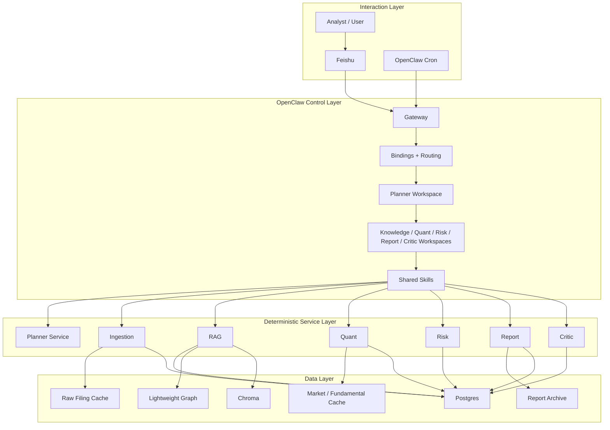

# OpenClaw Multi-Agent Architecture for US Market Research

## 1. Architectural Positioning

The project uses a pragmatic OpenClaw-native hybrid architecture:

- `OpenClaw` is the control plane
- deterministic `FastAPI` services are the execution plane
- `Postgres + Lightweight Graph + Chroma` form the data plane

This design keeps business logic testable and auditable while still exposing clear agent boundaries at the OpenClaw layer.

## 2. Runtime Layers

## 3. Agent Map

The current OpenClaw workspaces are:

- `planner`
- `knowledge`
- `quant`
- `risk`
- `report`
- `critic`

Their definitions live under:

- `openclaw/workspaces/`
- `openclaw/skills/`
- `openclaw/runtime/`

## 4. Responsibility Split

### Planner

- single public entry point
- intent classification
- route selection
- collaboration assembly
- final response packaging

### Knowledge

- retrieval planning
- evidence-pack generation
- graph-aware enrichment
- filing-centric synthesis

### Quant

- technical analysis
- valuation analysis
- financial analysis
- industry comparison
- composite scoring

### Risk

- drawdown and volatility analysis
- benchmark-relative risk
- concentration analysis
- scenario loss estimation

### Report

- daily report generation
- weekly report generation
- archive-ready markdown rendering

### Critic

- evidence sufficiency review
- freshness review
- consistency review
- overstatement review
- action-boundary recommendation

## 5. Implemented Collaboration Paths

- `DOC_QA`: `Planner -> Knowledge`
- `QUANT_QUERY`: `Planner -> Quant`
- `RISK_QUERY`: `Planner -> Risk`
- `MIXED_QUERY`: `Planner -> parallel(Knowledge, Quant, Risk)`
- `DAILY_REPORT`: `Planner -> parallel(Knowledge, Quant, Risk) -> Report -> Critic`
- `WEEKLY_REPORT`: `Planner -> Knowledge + Quant + Risk -> Report -> Critic`

This means the project already demonstrates real multi-agent collaboration while still keeping deterministic service execution underneath.

## 6. Data Sources and Universe

Current US-market migration choices:

- stock universe: `Magnificent 7`
- market data: `yfinance`
- filing source: `SEC EDGAR`
- benchmark: `SPY`

## 7. Storage Model

### Postgres

Primary structured storage for:

- documents
- reports
- run logs
- graph entities
- graph relations
- metric snapshots
- risk snapshots

### Lightweight Graph

Entity and relation context for:

- companies
- industries
- themes
- filings
- document links

### Chroma

Vector retrieval for indexed filing chunks and evidence search.

## 8. Ethics Layer

The architecture includes a cross-cutting ethics layer rather than a separate ethics microservice.

Every major output is expected to surface:

- `evidence_status`
- `data_freshness`
- `critic_status`
- `risk_status`
- `action_boundary`
- `human_approval_required`
- `accountability_trail`

The critic layer is mandatory for report delivery and can only make the final action boundary more restrictive.

## 9. Current Architectural Status

The architecture is already in a stable MVP state for:

- GitHub delivery
- local reproduction
- OpenClaw workspace demonstration
- ethics-aware multi-agent orchestration

The main optional future direction is deeper OpenClaw runtime-native execution through richer `sessions_spawn` behavior, not a structural rewrite.
