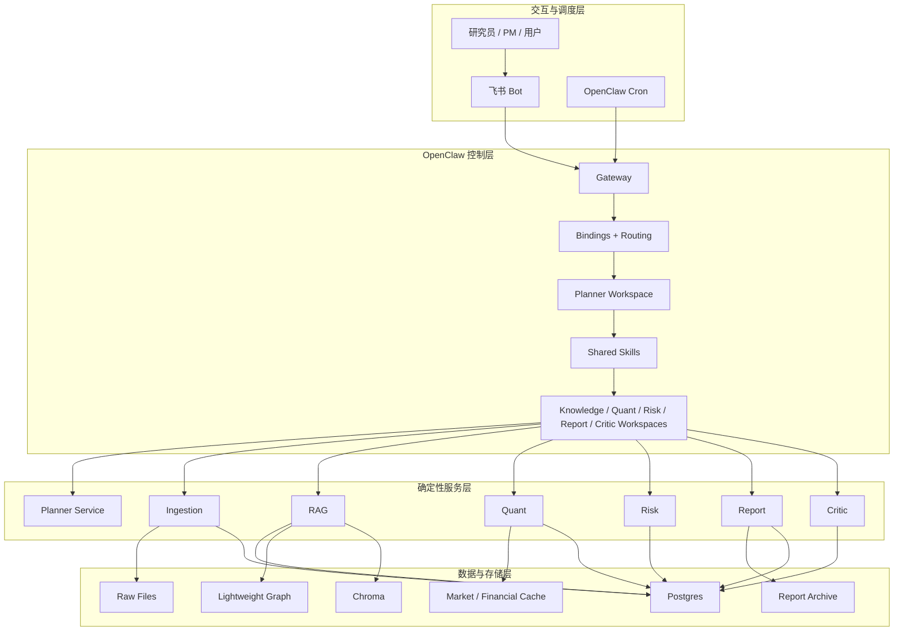

# 基于 OpenClaw 的量化投研 Multi-Agent 项目计划与现状说明

## 1. 项目概述

### 1.1 项目名称

基于 OpenClaw 的 Multi-Agent 量化投研系统

### 1.2 当前定位

本项目已经从“方案设计阶段”进入“可运行 MVP 阶段”。

当前系统已经具备：

- 飞书 + OpenClaw 的统一入口
- 新闻与公告采集
- `Postgres + 轻量知识图谱 + Chroma` 存储与检索结构
- 文档问答与证据包生成
- 技术面 + 基本面 + 估值面的量化分析
- 风险分析
- 日报 / 周报生成
- Critic 校验
- 运行日志、回放与基础运维能力

### 1.3 当前项目目标

当前版本的目标不是自动交易，而是构建一套可审计、可复现、可展示、可扩展的多 Agent 投研系统：

- 以 OpenClaw 作为控制面
- 以确定性 Python 服务作为执行底座
- 以多 Agent 协作组织研究、量化、风控和报告流程

## 2. 当前实现范围

### 2.1 已完成范围

#### 数据与知识层

- 多新闻源与公告源采集
- 去重、原文落盘、metadata 入库
- 目标股票池增量采集
- 按股票代码定向补采
- 文档切分
- Chroma 向量索引
- metadata 过滤
- 图谱上下文增强

#### 量化与风控层

- 行情因子
- 估值因子
- 财务因子
- 行业横向比较
- 组合评分
- 回撤分析
- 波动 / beta / 暴露分析
- 情景损失估算

#### 报告与交互层

- `DOC_QA`
- `QUANT_QUERY`
- `RISK_QUERY`
- `MIXED_QUERY`
- `DAILY_REPORT`
- `WEEKLY_REPORT`
- 飞书回环已完成验证

#### OpenClaw 编排层

- `planner / knowledge / quant / risk / report / critic` 六个 workspace
- shared skills
- runtime bootstrap
- cron 调度
- Feishu binding

### 2.2 当前未做或仅部分完成范围

- 更深度的 OpenClaw 原生 `sessions_spawn` 全面落地
- 完全去除 service bridge 的运行方式
- `ops` 维护类 workspace
- 更细粒度的自动告警与长期质量趋势
- 持仓诊断与调仓建议主流程
- 审批式纸面交易 / 执行适配器

## 3. 当前架构方案

### 3.1 四层结构

系统当前采用四层结构：

- 交互与调度层
- OpenClaw 控制层
- 确定性服务层
- 数据与存储层

### 3.2 当前 OpenClaw 角色

OpenClaw 当前承担的职责：

- 飞书接入
- cron 调度
- workspace 隔离
- skills 契约组织
- planner-first 路由

OpenClaw 当前不承担的职责：

- 原始网页采集
- 向量索引构建
- 指标计算
- 风险计算
- 报告模板渲染

这些仍由 `services/` 负责。

## 4. 当前 Agent 划分

### Planner

- 唯一入口
- 意图识别
- 路由
- 协作汇总

### Knowledge

- 检索规划
- 证据包生成
- 图谱增强检索

### Quant

- 技术面分析
- 估值因子
- 财务因子
- 行业横向比较

### Risk

- 风险指标
- 暴露分析
- 压力测试

### Report

- 日报 / 周报生成

### Critic

- 证据覆盖、时效性、一致性校验

## 5. 当前主业务流程

### 5.1 问答流程

当前已经实现：

- `DOC_QA`: `Planner -> Knowledge`
- `QUANT_QUERY`: `Planner -> Quant`
- `RISK_QUERY`: `Planner -> Risk`
- `MIXED_QUERY`: `Planner -> parallel(Knowledge, Quant, Risk)`

其中 `MIXED_QUERY` 已经引入并行 sub-agent 风格协作。

### 5.2 日报流程

当前已经实现：

- `Planner -> parallel(Knowledge, Quant, Risk) -> Report -> Critic`

这是当前最接近 OpenClaw 多 Agent 主链路的已落地实现。

### 5.3 周报流程

当前已经实现：

- `Planner -> Knowledge + Quant + Risk -> Report -> Critic`

周报已经可运行，但还没有完全收敛到与日报同强度的并行子协作模式。

## 6. 当前存储与检索结构

### 6.1 Postgres

主存储用于保存：

- 文档 metadata
- 股票主数据
- 图谱实体与关系
- 指标快照
- 风险快照
- 报告索引
- 运行日志

### 6.2 Lightweight Graph

当前已落地轻量知识图谱表：

- `entities`
- `document_entities`
- `relations`
- `entity_metric_snapshots`
- `entity_risk_snapshots`

### 6.3 Chroma

用于：

- 文档 chunk 向量检索
- 语义召回
- 混合检索中的向量层

## 7. 当前完成度判断

### 7.1 已经完成的目标

- 项目方案落地为可运行 MVP
- OpenClaw 编排层建立完成
- 基础多 Agent 路径已经成立
- 本地 / Docker / OpenClaw runtime 三套运行方式已经打通
- README、架构文档、系统说明、测试体系均已完善

### 7.2 当前项目是否可以收口

可以。

如果目标是：

- 作业提交
- GitHub 展示
- 本地可复现运行
- 展示 OpenClaw 与多 Agent 结合的系统设计

那么当前版本已经具备交付条件。

## 8. 当前剩余增强项

这些属于后续增强，而不是当前必须项：

1. 将 `MIXED_QUERY` 真正迁移为更原生的 OpenClaw `sessions_spawn`
2. 将 `DAILY_REPORT` 的并行协作进一步下沉到运行时级 sub-agent
3. 增加 `ops` workspace
4. 增加更细粒度自动告警与质量趋势跟踪
5. 扩展到持仓诊断、调仓建议与审批流

## 9. 当前推荐结论

当前项目不建议继续进行大规模架构重写。

推荐结论是：

- 现阶段收口
- 作为 MVP 提交和展示
- 后续如果要继续强化 OpenClaw-native 属性，再做增量演进

这能在“工程稳定性”和“OpenClaw 架构表达力”之间保持最好平衡。
