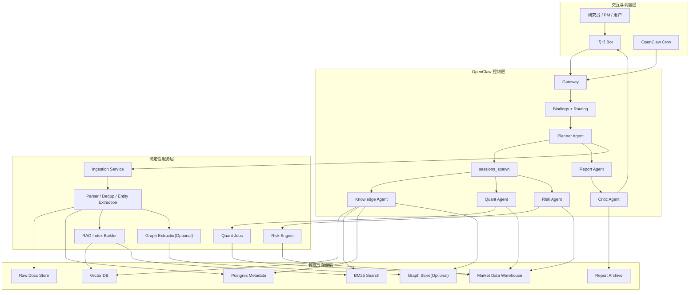
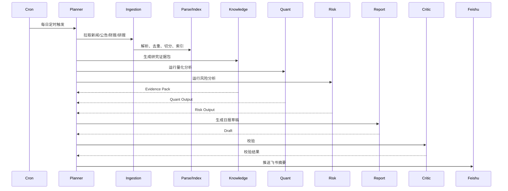
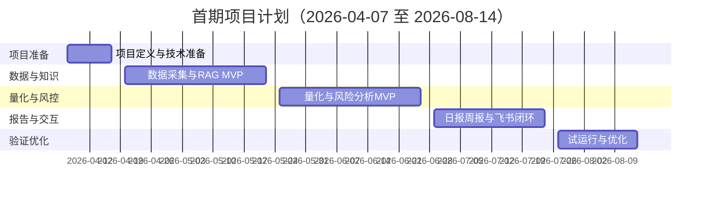

# 量子投研 Multi-Agent 系统项目计划书

## 1. 项目概述

### 1.1 项目名称

基于 OpenClaw 的 Multi-Agent 量子投研系统

### 1.2 项目定位

建设一套面向量化投资研究场景的多 Agent 投研平台，统一接入公开新闻、财报、研报、结构化行情与基本面数据，形成每日投资研报、每周复盘总结、投研问答与持仓风险分析能力，并为后续的调仓建议和人工审批执行预留架构基础。

### 1.3 项目目标

- 建立统一的投研控制面，使用 OpenClaw 完成任务编排、定时调度、消息路由和 Agent 协作
- 建立非结构化文档采集与 RAG 检索能力，支撑研究问答和报告生成
- 建立量化分析与风险分析能力，支撑策略信号、回撤、暴露与归因分析
- 打通飞书长连接，实现日报、周报、问答与审批消息推送
- 建立可审计、可复现、可扩展的系统基础，为后续仓位调整和人工审批执行做好准备

### 1.4 项目愿景

在不牺牲审计性和风控边界的前提下，把零散的新闻研究、量化分析、风险检查、报告编写与消息触达收敛为一套标准化、自动化、可演进的投研系统。

## 2. 背景与问题

当前投研工作通常存在以下痛点：

- 非结构化信息来源分散，难以稳定沉淀为可检索知识资产
- 量化分析和事件分析相互割裂，结论难以统一
- 研报生成高度依赖人工汇总，效率低且难以标准化
- 风险分析往往滞后于研究过程，无法形成研究到风控的一体化闭环
- 用户侧问答、日报推送、周报复盘缺乏统一入口

本项目旨在通过 OpenClaw 作为控制面、多 Agent 作为认知层、外部服务作为数据与计算层，构建统一投研工作流。

## 3. 建设原则

### 3.1 控制面与数据面分离

- OpenClaw 负责控制面
- 外部服务负责爬取、解析、索引、量化计算、风险计算
- Agent 负责规划、检索、解释、生成

### 3.2 Agent 负责决策与解释，服务负责确定性计算

- 报告和问答可以由 Agent 生成
- 回测、因子计算、回撤分析、风险约束必须由确定性程序完成

### 3.3 风控不是补丁，而是主链路

- 所有面向仓位、策略、调仓建议的输出都必须经过 Risk Agent 或风控引擎
- 自动执行必须晚于研究、建议、模拟和审批阶段

### 3.4 可追踪、可复现、可审计

- 每日任务有独立运行记录
- 报告结论可回溯到原始证据与结构化计算结果
- 所有未来涉及执行的动作必须保留审计链

## 4. 项目范围

### 4.1 第一阶段纳入范围

- 新闻、公告、财报、分析报告等公开资料采集
- 文档解析、去重、切分、向量化与关键词索引
- Dense + BM25 混合检索与 metadata 过滤
- Akshare 等结构化数据源接入
- 日度量化分析、回撤分析、风险暴露分析
- 每日研报生成与飞书推送
- 每周总结生成与飞书推送
- 用户在飞书中的投研问答

### 4.2 第二阶段纳入范围

- 持仓诊断
- 候选调仓建议
- 人工审批流
- 纸面交易模拟
- 可选的知识图谱增强检索

### 4.3 明确不在第一阶段范围内

- 自动实盘交易
- 无审批的自动调仓
- 覆盖全市场的高频实时交易决策
- 对外部付费数据源的深度集成

## 5. 总体架构方案

### 5.1 架构定位

本系统采用四层架构：

- 交互与调度层
- OpenClaw 控制层
- 确定性服务层
- 数据与存储层

### 5.2 OpenClaw 在系统中的角色

OpenClaw 不承担数据平台职责，而承担以下控制面职责：

- 统一接入飞书消息与定时任务
- 通过 bindings 将消息和任务路由到指定 Agent
- 通过 `sessions_spawn` 并行启动子 Agent 任务
- 管理 Agent 的工作空间、工具权限与隔离策略
- 汇总子任务结果并回传到飞书或报告归档系统

### 5.3 推荐 Agent 划分

#### Planner Agent

- 统一入口
- 意图识别
- 任务拆解
- 编排子 Agent 和外部服务

#### Knowledge Agent

- RAG 检索规划
- Query rewrite
- Dense + BM25 混合检索
- 证据包生成

#### Quant Agent

- 结构化数据获取
- 指标计算
- 回测与事件研究
- 因子与策略分析

#### Risk Agent

- 回撤分析
- 风险暴露分析
- 仓位约束检查
- 情景压力测试

#### Report Agent

- 日报和周报结构生成
- 研究结论、量化结论与风险结论拼装
- 面向飞书的摘要版输出

#### Critic Agent

- 证据覆盖检查
- 时效性检查
- 文本与量化结论冲突检查

## 6. 核心业务流程

### 6.1 每日研报流程

### 6.2 用户问答流程

- 用户在飞书中提问
- Planner Agent 识别问题类型
- 文档型问题交由 Knowledge Agent
- 结构化量化问题交由 Quant Agent
- 持仓、回撤、暴露问题交由 Risk Agent
- 混合型问题由 Planner 并行召回多个 Agent 结果后汇总

### 6.3 每周总结流程

- 汇总最近五个交易日市场变化、事件演化、量化结果与风险变化
- 生成周收益归因、错误案例复盘、下周观察清单
- 推送到飞书并归档

## 7. 关键能力建设清单

### 7.1 数据采集与治理

- 新闻站点采集
- 财报公告抓取
- 研报文本获取
- 去重与来源质量评分
- 公司、行业、主题、事件的 metadata 标注

### 7.2 RAG 与知识层

- 文档切分
- Parent-child chunk 关系组织
- 向量索引构建
- BM25 索引构建
- 混合召回与 rerank
- metadata 过滤
- 知识图谱增强接口预留

### 7.3 量化分析层

- 市场数据入仓
- 指标计算
- 因子分析
- 行业轮动
- 事件研究
- 回测评估

### 7.4 风险分析层

- 最大回撤
- 波动率
- 行业暴露
- 风格暴露
- 集中度
- 压力测试
- 风险阈值告警

### 7.5 报告与交互层

- 日报模板
- 周报模板
- 飞书消息卡片
- 证据引用
- 问答上下文管理

### 7.6 平台与运维层

- OpenClaw Gateway 部署
- 定时任务管理
- 日志、监控、告警
- 密钥与权限管理
- 报告归档

## 8. 实施阶段与里程碑

### 8.1 总体周期

建议首期建设周期为 `2026-04-07` 至 `2026-08-14`，共约 18 周。

### 8.2 阶段划分

#### 阶段 0：项目定义与技术准备

- 时间：`2026-04-07` 至 `2026-04-17`
- 目标：
  - 明确目标股票池、主题池、数据源与输出形式
  - 确认 OpenClaw 部署方式
  - 确认飞书接入方案
  - 完成 repo 结构、开发规范、环境规范
- 交付物：
  - 技术方案
  - 目录结构
  - 基础配置模板

#### 阶段 1：数据采集与 RAG MVP

- 时间：`2026-04-20` 至 `2026-05-22`
- 目标：
  - 完成公开资料采集链路
  - 完成文档解析、去重、切分、索引
  - 完成基础检索服务
  - 初版 Knowledge Agent 可返回带证据问答
- 交付物：
  - Ingestion Service
  - RAG 索引链路
  - 基础检索 API
  - Knowledge Agent MVP

#### 阶段 2：量化与风险分析 MVP

- 时间：`2026-05-25` 至 `2026-06-26`
- 目标：
  - 接入 Akshare 等结构化数据源
  - 完成日度量化分析脚本
  - 完成回撤、暴露与基础风险引擎
  - 完成 Quant Agent 与 Risk Agent 编排
- 交付物：
  - Quant Jobs
  - Risk Engine
  - Quant Agent MVP
  - Risk Agent MVP

#### 阶段 3：日报、周报与飞书闭环

- 时间：`2026-06-29` 至 `2026-07-24`
- 目标：
  - 接入飞书长连接
  - 打通日报生成与推送
  - 打通周报生成与推送
  - 完成 Planner、Report、Critic 的主流程联调
- 交付物：
  - Planner Agent MVP
  - Report Agent MVP
  - Critic Agent MVP
  - 飞书集成与定时任务

#### 阶段 4：试运行与优化

- 时间：`2026-07-27` 至 `2026-08-14`
- 目标：
  - 试运行日报与周报
  - 评估问答准确率与证据覆盖率
  - 优化延迟、失败重试、日志和告警
  - 输出第二阶段持仓诊断与调仓建议规划
- 交付物：
  - 试运行报告
  - 性能与质量评估报告
  - 第二阶段建设建议

### 8.3 甘特图

## 9. 项目组织与角色分工

### 9.1 推荐最小团队配置

- 项目负责人 / 产品负责人：1 人
- 技术负责人 / 架构负责人：1 人
- 后端与平台工程师：1 至 2 人
- 量化工程师：1 人
- 检索与 NLP 工程师：1 人
- 测试与运维支持：0.5 至 1 人

### 9.2 角色职责

#### 项目负责人

- 范围管理
- 优先级管理
- 业务验收

#### 技术负责人

- 技术架构
- OpenClaw 编排方案
- 技术风险控制

#### 后端与平台工程师

- 数据采集服务
- 索引服务
- 报告归档
- 飞书接入
- 调度和部署

#### 量化工程师

- 指标与因子定义
- 回测与分析脚本
- 风险模型与分析逻辑

#### 检索与 NLP 工程师

- 文档切分
- 检索策略
- metadata 设计
- 证据聚合

## 10. 关键里程碑交付物

### 10.1 阶段性交付清单

- 项目计划书
- 架构设计文档
- OpenClaw 配置与 Agent 说明文档
- 数据采集服务与索引服务
- Quant Jobs 与 Risk Engine
- 日报、周报模板
- 飞书对接与定时任务配置
- 试运行报告

### 10.2 最终首期交付结果

- 可稳定生成每日投资研报
- 可稳定生成每周总结
- 可在飞书内处理基础投研问答
- 可输出回撤、暴露和风险分析
- 具备持仓诊断与调仓建议的扩展基础

## 11. 验收标准

### 11.1 功能验收

- 可按计划时间自动生成日报
- 可按计划时间自动生成周报
- 可接收飞书提问并返回结构化回答
- 报告中可展示主要证据来源与时间信息
- 可输出至少一类回撤分析和一类风险暴露分析

### 11.2 质量验收

- 公开资料采集成功率不低于 `95%`
- 日报任务成功率不低于 `90%`
- 日报推送延迟控制在目标时间窗内
- 关键结论应可追溯到证据源
- 检索结果支持 metadata 过滤

### 11.3 运维验收

- 关键任务有日志与失败告警
- 飞书连接故障可恢复
- 配置、密钥、数据源可独立管理

## 12. 风险与应对

### 12.1 数据风险

- 风险：
  - 数据源变更
  - 网页结构变化
  - 文档质量不稳定
- 应对：
  - 设计多源冗余
  - 引入解析失败重试与告警
  - 对来源做质量评分

### 12.2 检索风险

- 风险：
  - 检索召回不足
  - 召回文档时效性差
  - 文本回答存在幻觉
- 应对：
  - 混合检索
  - 时间过滤
  - Critic Agent 校验
  - 回答附带证据

### 12.3 量化风险

- 风险：
  - 指标口径不一致
  - 未来函数
  - 回测失真
- 应对：
  - 脚本版本化
  - 明确口径与样本范围
  - 独立回测审查

### 12.4 风控风险

- 风险：
  - 对风险的解释与真实约束脱节
  - 调仓建议绕过风控
- 应对：
  - 风控引擎独立部署
  - Risk Agent 成为强制门禁
  - 执行前必须审批

### 12.5 组织风险

- 风险：
  - 目标范围膨胀
  - 一期想同时做报告、问答、图谱、调仓、执行
- 应对：
  - 一期只做日报、周报、问答和风险分析
  - 二期再做持仓诊断和调仓建议

## 13. 技术选型建议

### 13.1 控制面

- OpenClaw Gateway
- Feishu Channel
- Cron
- Bindings
- `sessions_spawn`

### 13.2 数据与检索

- 文档存储：对象存储或文件存储
- 元数据：Postgres
- 向量库：Chroma 作为 MVP
- 关键词检索：OpenSearch 或 Elasticsearch

### 13.3 量化与风控

- 数据接入：Akshare
- 分析框架：Python
- 数据仓：Parquet / ClickHouse / Timescale 视规模选择

### 13.4 监控与运维

- 日志集中采集
- 任务告警
- 定时任务状态监控

## 14. 后续扩展路线

### 14.1 第二阶段

- 知识图谱增强
- 持仓画像
- 调仓候选建议
- 人工审批卡片

### 14.2 第三阶段

- 纸面交易模拟
- 策略效果跟踪
- 用户风险偏好与账户约束管理

### 14.3 第四阶段

- 对接执行系统或券商接口
- 人工确认后的半自动执行
- 全量审计与合规留痕

## 15. 立项结论

本项目具备明确的业务价值和可执行的技术路径。推荐以 OpenClaw 为控制面、以外部服务为数据与计算底座，采用“先报告与问答、后持仓诊断、再审批式调仓”的分阶段推进方式。

首期目标不应追求“全自动投资”，而应优先建立以下闭环：

- 自动采集
- 自动检索
- 自动量化分析
- 自动风险分析
- 自动日报与周报
- 飞书问答与推送

在首期闭环跑稳后，再进入持仓诊断、调仓建议和审批执行阶段。
